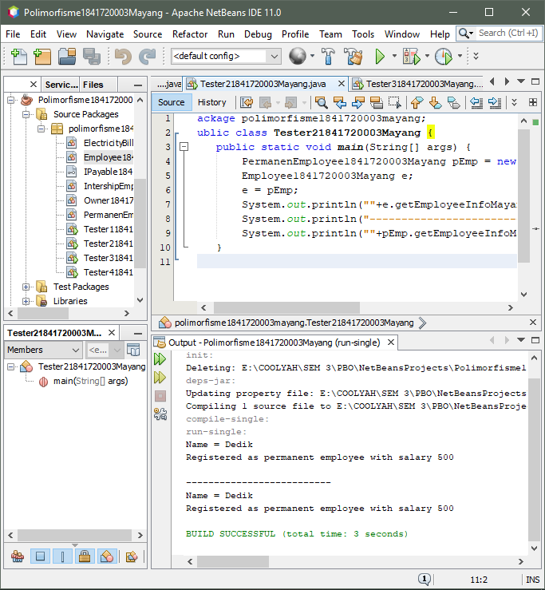

# Laporan Praktikum 10 - POLIMORFISME
# Kompetensi
Setelah menyelesaikan lembar kerja ini mahasiswa diharapkan mampu:
- Memahami konsep dan bentuk dasar polimorfisme
- Memahami konsep virtual method invication
- Menerapkan polimorfisme pada pembuatan heterogeneous collection
- Menerapkan polimorfisme pada parameter/argument method
- Menerapkan object casting untuk meng-ubah bentuk objek

## Ringkasan Materi
Polimorfisme ada 2 macam yaitu
1. Static
    menggunakan konsep Overloading
2. Dinamic
    menggunakan konsep Overriding

Konsep polimorfisme bisa diterapkan pada class-class yang memiliki relasi inheritance .polimorfisme juga bisa diterapkan pada interface. Ketika ada objek yang dideklarasikan dari suatu interface, maka ia bisa digunakan untuk mereferensi ke objek dari class-class yang implements ke interface tersebut.

## Studi Kasus

## Percobaan
### Percobaan 1 - Bentuk dasar polimorfisme
Pada percobaan pertama ini kita akan membuat sebuah program yang menggambarkan Studi Kasus di atas

- Buatlah class Employee

    Class Employee--> [Employee1841720003Mayang.java](../../src/10_Polimorfisme/Employee1841720003Mayang.java)

    

- Buatlah class Payable

    Class Payable--> [Payable1841720003Mayang.java](../../src/10_Polimorfisme/Payable1841720003Mayang.java)

    

- Buatlah clas IntershipEmployee

    Class IntershipEmployee--> [IntershipEmployee1841720003Mayang.java](../../src/10_Polimorfisme/IntershipEmployee1841720003Mayang.java)

    

- Buat class PermanentEmployee, subclass dari Employee dan implements ke Payable

    Class PermanentEmployee--> [PermanentEmployee1841720003Mayang.java](../../src/10_Polimorfisme/PermanentEmployee1841720003Mayang.java)

    

- Buat class ElectricityBill yang implements ke interface Payable

    Class ElectricityBill--> [ElectricityBill1841720003Mayang.java](../../src/10_Polimorfisme/ElectricityBill1841720003Mayang.java)

    

- Buatlah class Main Tester1

    Class Tester1--> [Tester11841720003Mayang.java](../../src/10_Polimorfisme/Tester11841720003Mayang.java)

    

### Pertanyaan Percobaan 1
1. Class apa sajakah yang merupakan turunan dari class Employee?

    Jawab:
    class InternshipEmployee dan class PermanentEmployee.

2. Class apa sajakah yang implements ke interface Payable?

    Jawab:
    class ElectricityBill dan class PermanentEmployee

3. Perhatikan class Tester1, baris ke-10 dan 11. Mengapa e, bisa diisi dengan objek pEmp (merupakan objek dari class PermanentEmployee) dan objek iEmp (merupakan objek dari class InternshipEmploye) ?

    Jawab:
    Karena e merupakan deklarasi dari class Employee yang mempunyai subclass permanentEmployee yang berobjek (pEmp) dan IntershipEmployee yang berobjek (iEmp), maka dari itu e bisa memanggil kedua-nya

4. Perhatikan class Tester1, baris ke-12 dan 13. Mengapa p, bisa diisi dengan objek pEmp (merupakan objek dari class PermanentEmployee) dan objek eBill (merupakan objek dari class ElectricityBill) ?

    Jawab:
    Karena p merupakan deklarasi dari class Payable dan class permanentEmployee yang berobjek (pEmp) dan ElectricityBill yang berobjek (eBill) class yang mengimplements dari class Payable, maka dari itu p bisa memanggil kedua-nya

5. Coba tambahkan sintaks:
    
    p = iEmp;

    e = eBill;
    
    pada baris 14 dan 15 (baris terakhir dalam method main) ! Apa yang menyebabkan error?

    Jawab:
    Karena IntershipEmployee bukan turunan dari class Payable, dan ElectricityBill juga bukan turunan dari class Employee

6. Ambil kesimpulan tentang konsep/bentuk dasar polimorfisme!

    Jawab:
    Polimorfisme bisa diterapkan pada class yang memiliki relasi inheritance dan interface. Ketika ada objek yang dideklarasikan dari suatu interface, maka ia bisa digunakan untuk mereferensikan ke objek yang mengimplements class interface tersebut

### Percobaan 2 – Virtual method invocation
Pada percobaan ini masih akan digunakan class-class dan interface yang digunakan pada percobaan sebelumnya.

- Buat class baru dengan nama Tester2

    Class Tester 2--> [Tester21841720003Mayang.java](../../src/10_Polimorfisme/Tester21841720003Mayang.java)

    

### Pertanyaan Percobaan 2
1. Perhatikan class Tester2 di atas, mengapa pemanggilan e.getEmployeeInfo() pada baris 8 dan pEmp.getEmployeeInfo() pada baris 10 menghasilkan hasil sama?

    Jawab:
    Karena pada baris ke 7 sudah dideklarasikan bahwa object e merupakan pEmp.

2. Mengapa pemanggilan method e.getEmployeeInfo() disebut sebagai pemanggilan method virtual (virtual method invication),sedangkan pEmp.getEmployeeInfo() tidak?

    Jawab:
    Karena e memanggil method overriding dari class permanentEmployee, maka saat itu terjadi pemanggilan method virtual

3. Jadi apakah yang dimaksud dari virtual method invocation? Mengapa disebut virtual?

    Jawab:
    Pemanggilan overriding method dari suatu objek polimorfisme. Disebut virtual karena antara method yang dikenali oleh compiler dan method yang dijalankan oleh JVM berbeda

###  Percobaan 3 – Heterogenous Collection
Pada percobaan ke-3 ini, masih akan digunakan class-class dan
interface pada percobaan sebelumnya.

- Buatlah class baru Tester3

    Class Tester 3--> [Tester31841720003Mayang.java](../../src/10_Polimorfisme/Tester31841720003Mayang.java)

    

### Pertanyaan Percobaan 3
1. Perhatikan array e pada baris ke-8, mengapa ia bisa diisi dengan objek-objek dengan tipe yang berbeda, yaitu objek pEmp (objek dari PermanentEmployee) dan objek iEmp (objek dari InternshipEmployee) ?

    Jawab:
    Karena objek pEmp dan iEmp merupakan object dari class yang merupakan turunan dari class Employee

2. Perhatikan juga baris ke-9, mengapa array p juga biisi dengan objekobjek dengan tipe yang berbeda, yaitu objek pEmp (objek dari PermanentEmployee) dan objek eBill (objek dari ElectricityBilling) ?

    Jawab:
    Karena objek pEmp dan eBill merupakan object dari class yang mengimplements dari class Payable

3. Perhatikan baris ke-10, mengapa terjadi error?

    Jawab:
    Karena eBill bukan termasuk Class turunan dari Class Employee

###  Percobaan 4 – Argumen polimorfisme, instanceod dan casting objek
Percobaan 4 ini juga masih menggunakan class-class dan interface yang digunakan pada percobaan sebelumnya

- Buat class baru dengan nama Owner. Owner bisa melakukan pembayaran baik kepada pegawai permanen maupun rekening listrik melalui method pay(). Selain itu juga bisa menampilkan info pegawai permanen maupun pegawai magang melalui method
showMyEmployee().

    

    Class Owner--> [Owner1841720003Mayang.java](../../src/10_Polimorfisme/Owner1841720003Mayang.java)

    

- Buatlah class baru Tester4

    Class Tester 4--> [Tester41841720003Mayang.java](../../src/10_Polimorfisme/Tester41841720003Mayang.java)

    

### Pertanyaan Percobaan 4
1. Perhatikan class Tester4 baris ke-7 dan baris ke-11, mengapa pemanggilan ow.pay(eBill) dan ow.pay(pEmp) bisa dilakukan, padahal jika diperhatikan method pay() yang ada di dalam class Owner memiliki argument/parameter bertipe Payable? Jika diperhatikan eBill merupakan objek dari ElectricityBill dan pEmp merupakan objek dari PermanentEmployee?

    Jawab:
    Karena keduanya sama - sama mengimplementasikan interface Payable

2. Jadi apakah tujuan membuat argument bertipe Payable pada
method pay() yang ada di dalam class Owner?

    Jawab:
    Agar bisa memanggil method getPaymentAmount yang ada di masing – masing object yang dimasukkan sebagai parameter

3. Coba pada baris terakhir method main() yang ada di dalam class Tester4 ditambahkan perintah ow.pay(iEmp); mengapa terjadi error?

    Jawab:
    iEmp tidak mengimplements class Payable

4. Perhatikan class Owner, diperlukan untuk apakah sintaks p
instanceof ElectricityBill pada baris ke-6 ?

    Jawab:
    Untuk mengecek apakah object yang dimasukkan sebagai implements dari Payable atau tidak

5. Perhatikan kembali class Owner baris ke-7, untuk apakah casting objek disana (ElectricityBill eb = (ElectricityBill) p diperlukan ? Mengapa objek p yang bertipe Payable harus di-casting ke dalam objek eb yang bertipe ElectricityBill ?

    Jawab:
    Untuk dikembalikan ke instansiasi sesungguhnya sehingga dapat memanggil method getBillInfo() yang hanya ada di class ElectricityBill

## TUGAS
Dalam suatu permainan, Zombie dan Barrier bisa dihancurkan oleh Plant dan bisa menyembuhkan diri. Terdapat dua jenis Zombie, yaitu Walking Zombie dan Jumping Zombie. Kedua Zombie tersebut memiliki cara penyembuhan yang berbeda, demikian juga cara penghancurannya, yaitu ditentukan oleh aturan berikut ini:
- Pada WalkingZombie
    - Penyembuhan : Penyembuhan ditentukan berdasar level
    zombie yang bersangkutan
    - Jika zombie level 1, maka setiap kali penyembuhan,
    health akan bertambah 20%
    - Jika zombie level 2, maka setiap kali penyembuhan,
    health akan bertambah 30% 
    - Jika zombie level 3, maka setiap kali penyembuhan,
    health akan bertambah 40%

    - Penghancuran : setiap kali penghancuran, health akan
    berkurang 2%

- Pada Jumping Zombie
    - Penyembuhan : Penyembuhan ditentukan berdasar level
    zombie yang bersangkutan
    - Jika zombie level 1, maka setiap kali penyembuhan,
    health akan bertambah 30%
    - Jika zombie level 2, maka setiap kali penyembuhan,
    health akan bertambah 40%
    - Jika zombie level 3, maka setiap kali penyembuhan,
    health akan bertambah 50%

    - Penghancuran : setiap kali penghancuran, health akan
    berkurang 1%

    Buat program dari class diagram di bawah ini!

    

- Class Zombie meng-Implements Class Destroy

    Class Zombie--> [Zombie1841720003Mayang.java](../../src/10_Polimorfisme/Zombie1841720003Mayang.java)

    

- Class Walking Zombie extends Class Zombie

    Class Walking Zombie--> [WalkingZombie1841720003Mayang.java](../../src/10_Polimorfisme/WalkingZombie1841720003Mayang.java)

    

- Class Jumping Zombie extends Class Zombie

    Class Jumping Zombie--> [JumpingZombie1841720003Mayang.java](../../src/10_Polimorfisme/JumpingZombie1841720003Mayang.java)

    

- Class Implements Destroy

    Class Destroy--> [Destroyable1841720003Mayang.java](../../src/10_Polimorfisme/Destroyable1841720003Mayang.java)

    

- Class Barrier meng-Implements Class Destroy

    Class Barrier--> [Barrier1841720003Mayang.java](../../src/10_Polimorfisme/Barrier1841720003Mayang.java)

    

- Class Plant

    Class Plant--> [Plant1841720003Mayang.java](../../src/10_Polimorfisme/Plant1841720003Mayang.java)

    
    
- Class Main Tester

    Class Tester--> [Tester1841720003Mayang.java](../../src/10_Polimorfisme/Tester1841720003Mayang.java)

    

## Kesimpulan
Polimorfisme bisa diterapkan pada class yang memiliki relasi inheritance dan interface. Ketika ada objek yang dideklarasikan dari suatu interface, maka ia bisa digunakan untuk mereferensikan ke objek yang mengimplements class interface tersebut

## Pernyataan Diri
Saya menyatakan isi tugas, kode program, dan laporan praktikum ini dibuat oleh saya sendiri. Saya tidak melakukan plagiasi, kecurangan, menyalin/menggandakan milik orang lain. Jika saya melakukan plagiasi, kecurangan, atau melanggar hak kekayaan intelektual, saya siap untuk mendapat sanksi atau hukuman sesuai peraturan perundang-undangan yang berlaku.

Ttd,

***(Mayang Muria Cahyaningsih)***