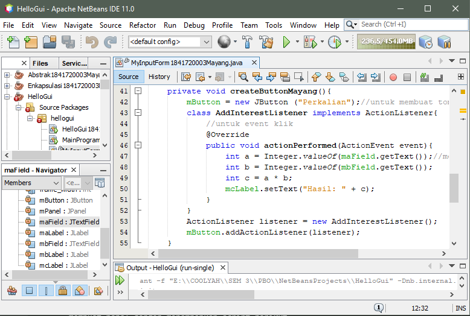
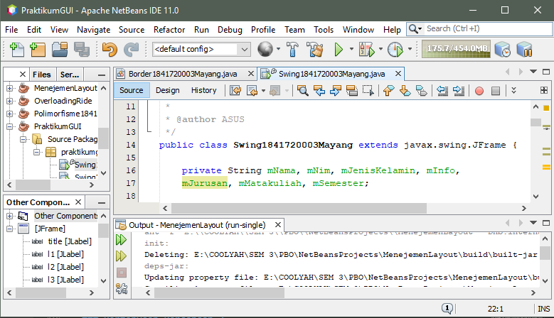
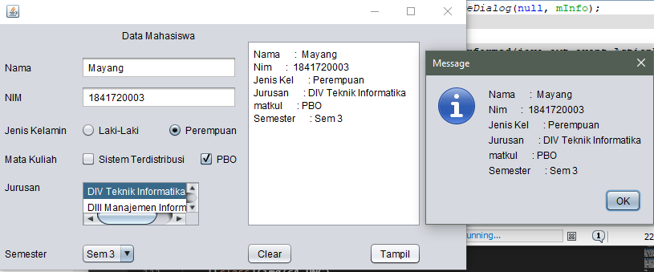

# Laporan Praktikum 11 - GUI
# Kompetensi
Setelah menyelesaikan lembar kerja ini mahasiswa diharapkan mampu:
1. Membuat aplikasi Graphical User Interface sederhana dengan bahasa pemrograman java;
2. Mengenal komponen GUI seperti frame, label, textfield, combobox, radiobutton, checkbox, textarea, menu, serta table;
3. Menambahkan event handling pada aplikasi GUI.

## Ringkasan Materi
Java Swing merupakan bagian dari JFC (Java Foundation Classes) yang menyediakan API untuk menangani hal yang berkaitan dengan GUI bagi program Java. Kita bisa membedakan komponen Swing dengan komponen AWT, di mana pada umumnya kelas-kelas yang berada dalam komponen Swing diawali dengan huruf J, misal: JButton, JLabel, JTextField, JRadioButton.

## Percobaan
### Percobaan 1 - JFrame HelloGUI
- Buatlah sebuah project baru di NetBeans dengan nama HelloGui
- Tambahkan paket Java ke dalam kode program, import javax.swing.*;
- Pada program utama main(), tuliskan script code berikut

    Class HelloGui--> [HelloGui1841720003Mayang.java](../../src/11_GUI/HelloGui1841720003Mayang.java)

    

    Hasil nya

    

### Percobaan 2 - Menangani Input Pada GUI
- Pada kelas MyInputForm tambahkan beberapa library dan Jadikan kelas MyInputForm sebagai turunan dari kelas JFrame

    

- Pada kelas MyInputForm tambahkan beberapa variable berikut

    

- Buatlah konstruktor dengan nama MyInputForm() dan tambahkan script berikut

    

- Buatlah method createTextField() dan tambahkan script berikut untuk menampilkan Text field sebagai inputan maupun output pada window

    

- Tambahkan method createButton() untuk membuat tampilan button/tombol pada window, dan ketikkan script berikut sebagai event handling ketika button di klik

    

- Selanjtnya, buat method dengan nama createPanel() yang berfungsi untuk membuat panel dengan menambahkan script berikut

    

- Langkah berikutnya, pada main program tambahkan script berikut, Compile dan Run program, maka akan tampil hasil/output perkalian nilai A dan Nilai B sebagai berikut

    

    Class MyInputForm--> [MyInputForm1841720003Mayang.java](../../src/11_GUI/MyInputForm1841720003Mayang.java)

    Class MainProgram--> [MainProgram1841720003Mayang.java](../../src/11_GUI/MainProgram1841720003Mayang.java)

### Pertanyaan Percobaan 2
1. Modifikasi percobaan di atas dengan menambahkan button penjumlahan
    
    

    Class MyInputFormModif--> [MyInputFormModif1841720003Mayang.java](../../src/11_GUI/MyInputFormModif1841720003Mayang.java)

    Class MainProgramModif--> [MainProgramModif1841720003Mayang.java](../../src/11_GUI/MainProgramModif1841720003Mayang.java)

### Percobaan 3 - Manajemen Layout
- Pada kelas Border, Grid dan Box tambahkan library yang akan digunakan sebagai berikut, Pada setiap kelas Border, Grid dan Box jadikan sebagai kelas turunan dari JFrame

    

- Pada kelas Border Ketikkan sript berikut untuk membuat tampilan window dengan meletakkan tombol pada 5 lokasi sebagaimana gambar diatas yaitu (Utara, barat, tengah, timur, dan selatan)

    

- Selanjutnya, pada kelas Grid ketikkan script berikut untuk membuat layout grid dengan memiliki ukuran 4x2 dan pada masing-masing grid akan diisi dengan tombol

    

- Kemudian pada kelas Box, masukkan script berikut untuk membuat tampilan layout dengan bentuk Box Layout dan orientasi Y

    

- Langkah selanjutnya, diperlukan inisiasi object dari masing-masing layout pada object JFrame. Sehingga Pada kelas LayoutGUI perlu diatur setDefaultCloseOperation() dan setVisible() dengan mengetikkan script berikut, dengan sebelumnya tambahkan library javax.swing.JFrame pada kelas LayoutGUI

    

- Compile dan Run program, maka akan tampil 3 hasil/output dari Border Layout, Grid Layout, dan Box Layout sebagai berikut

    

    Class Border--> [Border1841720003Mayang.java](../../src/11_GUI/Border1841720003Mayang.java)

    Class Grid--> [Grid1841720003Mayang.java](../../src/11_GUI/Grid1841720003Mayang.java)

    Class Box--> [Box1841720003Mayang.java](../../src/11_GUI/Box1841720003Mayang.java)

    Class Layout--> [Layout1841720003Mayang.java](../../src/11_GUI/Layout1841720003Mayang.java)

### Pertanyaan Percobaan 3
1. Apa perbedaan dari Grid Layout, Box Layout dan Border Layout?

    Jawab:

    Grid : Penempatan komponen dalam bentuk “rectangular grid” dan berdasarkan jumlah baris dan kolom yang diinginkan.

    Box : Penempatan komponen dalam satu baris atau satu kolom.

    Border : Penyusun komponen berdasarkan lokasi geografis: NORTH,SOUTH, EAST, WEST, and CENTER.

2. Apakah fungsi dari masing-masing kode berikut?

    

    Jawab:

    Yang atas digunakan untuk mendeklarasikan objek dari class JFrame dan memberi nama objek frame yang dibuat dengan nama frame, frame2, frame3. yang tengah ketika kita menekan tombol close maka kita akan keluar dari program. yang bawah untuk menampilkan frame dimana setVisible merupakan bentuk dari Boolean yang merupakan salah satu macam type data dalam java yang digunakan untuk menampilkan pilihan true or false.

### Percobaan 4 - Membuat GUI Melalui IDE Netbeans
- Buat Project, beri nama project dengan nama PraktikumGUI, Klik kanan pada package untuk membuat frame baru, New | JFrame Form. Selanjutnya setelah muncul jendela new JFrame Form, pada Field Class Name berikan nama Swing, kemudian klik finish.

- Buatlah design Form seperti gambar di bawah ini, Lalu ubah nama variable dan nama text pada setiap komponen Swing, dengan cara klik kanan | Change Variable Name untuk merubah nama variable serta klik kanan | Edit Text untuk merubah nama text. Sesuaikan variable name dan text name

    

- Selanjutnya, setelah design selesai pindah ke tab Source kemudian pada kelas Swing tambahkan variable yang dibutuhkan sebagaimana pada script berikut

    

- kembali ke tab Design dan double klik pada komponen JButton cmdtampil. Maka anda akan masuk pada bagian coding/source code dari cmdtampil kemudian ketikkan script berikut, yang memiliki fungsi untuk memberikan event handling pada JButton cmdtampil saat di klik oleh user

    

- Dan pada komponen JButton cmdclear lakukan hal yang sama denan memasukan script berikut

    

- lakukan compile dan run pada project anda, maka program akan tampil seperti gambar berikut dan silahkan isi data anda kemudia klik tampilkan

    

    Class Form Swing--> [Swing1841720003Mayang.java](../../src/11_GUI/Swing1841720003Mayang.java)

### Pertanyaan Percobaan 4
1. Apakah fungsi dari kode berikut?

    

    Jawab:
    Untuk menampilkan JFrame Form

2. Mengapa pada bagian logika checkbox dan radio button digunakan multiple if ?

    Jawab:
    Agar pengguna tidak dapat memilih keduanya dan untuk melakukan pengecekan checkbox apakah sudah di checklist atau belum

3. Lakukan modifikasi pada program untuk melakukan menambahkan inputan berupa alamat dan berikan fungsi pemeriksaan pada nilai Alamat tersebut jika belum diisi dengan menampilkan pesan peringatan

    Jawab:

    mAlamat = alamat.getText();
    
    mInfo+="Alamat       : "+mAlamat+ "\n";
    
    JOptionPane.showMessageDialog(null, "Harap isi Alamat", "Isi dengan benar", JOptionPane.WARNING_MESSAGE);

    

    Class Form Swing 2--> [Swing1841720003Mayang1.java](../../src/11_GUI/Swing1841720003Mayang1.java)

### Percobaan 5 - JTabPane, JTtree, JTable
- Setelah JFrame Form selesai dibuat, Drag & Drop komponen swing JTabPane dari Palette ke bagian form, Selanjutnya, Drag & Drop Panel kedalam JTabPane yang telah dibuat, maka akan terbentuk tab baru di dalam JTabPane. Lakukan dengan cara yang sama, drag & drop panel hingga JTabPane memiliki 3 Tab sebagaimana pada gambar berikut

    

- Kemudian anda dapat mengedit Text pada Tab tersebut dengan cara klik kanan pada tab tersebut dan pilih Edit Text. Ubahlah nama tab menjadi Halaman1 , Halaman 2 dan Halaman 3

- Pada tab halaman 1 tambahkan komponen JLabel dan edit text menjadi Halaman pertama untuk menandai tab Halaman 1.

- Lakukan hal yang sama pada halaman2 dengan menambahkan komponen JTabel dengan cara drag & drop Jtabel ke tab Halaman 2

- Pada tab halaman 3 tambahkan komponen JTree dengan cara drag & drop, sehingga tampilan pada tab Halaman 3. Kemudian klik kanan pada JTree dan pilih Property selanjutnya pada bagian Model klik titiktitik pada bagian kanan model, Maka akan muncul jendela baru dan hapus semua item di kolom sebelah kiri

- Langkah selanjutna, pada tab halaman 3 tambahkan 1 buah JTextField dan 1 buah JButton sehinnga tampilan akan menjadi seperti berikut

    

- Selanjutnya, double klik pada Jbutton cmdtambah. Maka anda akan masuk pada bagian coding / source code, kemudain tambahkan script berikut

    

-  Langkah terakhir, lakukan compile dan run pada project anda, maka program akan tampil, Pilih tab Halaman 3 dan Klik pada Jtree root. Dan ketikan Bapak pada JTextField kemudian klik Tambah. Maka Jtree akan bertambah seperti pada gambar berikut

    

    Class Form Swing 2--> [Swing21841720003Mayang.java](../../src/11_GUI/Swing21841720003Mayang.java)

### Pertanyaan Percobaan 5
1. Apa kegunaan komponen swing JTabPane, JTtree, pada percobaan 5?

    Jawab:
    
    JTree merupakan komponen yang digunakan untuk membuat struktur pohon.
    
    JTabbedPane merupakan komponen grafis yang digunakan untuk menyusun dan mengelompokkan berbagai komponen Java lain ke dalam lapisan-lapisan (layers). JTabbedPane termasuk kelas-kelas wadah (container classes) yang terletak di paket javax.swing.

2. Modifikasi program untuk menambahkan komponen JTable pada tab Halaman 1 dan tab Halaman 2

    Jawab:

    

    

## TUGAS
Buatlah Sebuah Program yang mempunyai fungsi seperti kalkulator (mampu menjumlahkan, mengurangkan, mengalikan dan membagikan. Dengan tampilan seperti berikut.

Class Tugas--> [Tugas1841720003Mayang.java](../../src/11_GUI/Tugas1841720003Mayang.java)

## Kesimpulan
Jadi GUI sangat jelas kaitanya dengan kegiatan penggunaan suatu aplikasi dalam komputer yang sering digunakan. Dalam hal ini, GUI mempermudah user dalam penggunaannya, dengan tampilan yang friendly seta ergonomis, user dengan mudah dapat menyesuaikan aplikasi-aplikasi karena GUI membantu didalam interface yang dapat dipahami penggunaannya. Sehingga antara user dan sistem, tidak terjadi misscommuncation dalam menerapkan sistem komputerisasi.

## Pernyataan Diri
Saya menyatakan isi tugas, kode program, dan laporan praktikum ini dibuat oleh saya sendiri. Saya tidak melakukan plagiasi, kecurangan, menyalin/menggandakan milik orang lain. Jika saya melakukan plagiasi, kecurangan, atau melanggar hak kekayaan intelektual, saya siap untuk mendapat sanksi atau hukuman sesuai peraturan perundang-undangan yang berlaku.

Ttd,

***(Mayang Muria Cahyaningsih)***