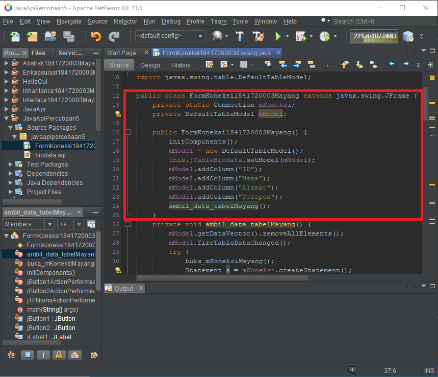
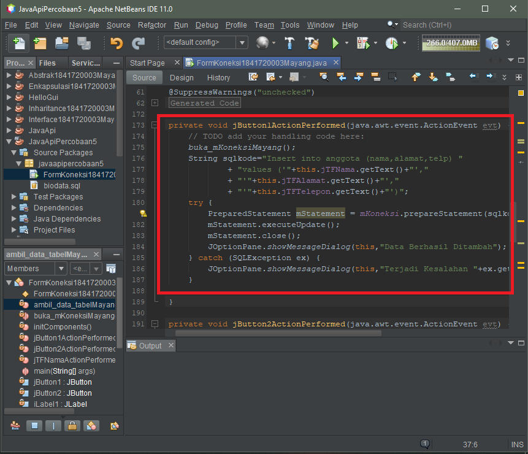
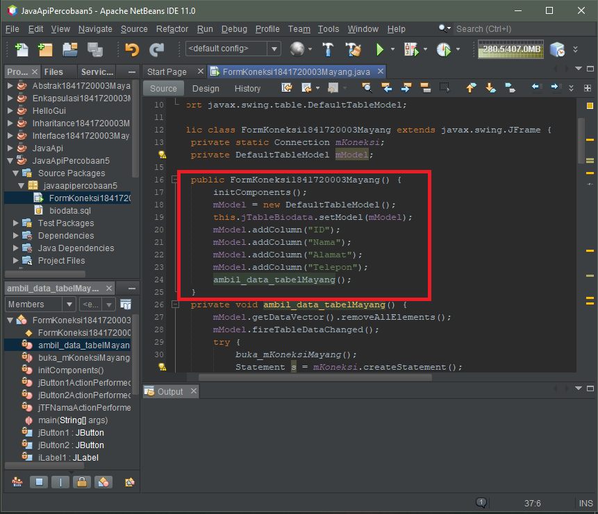
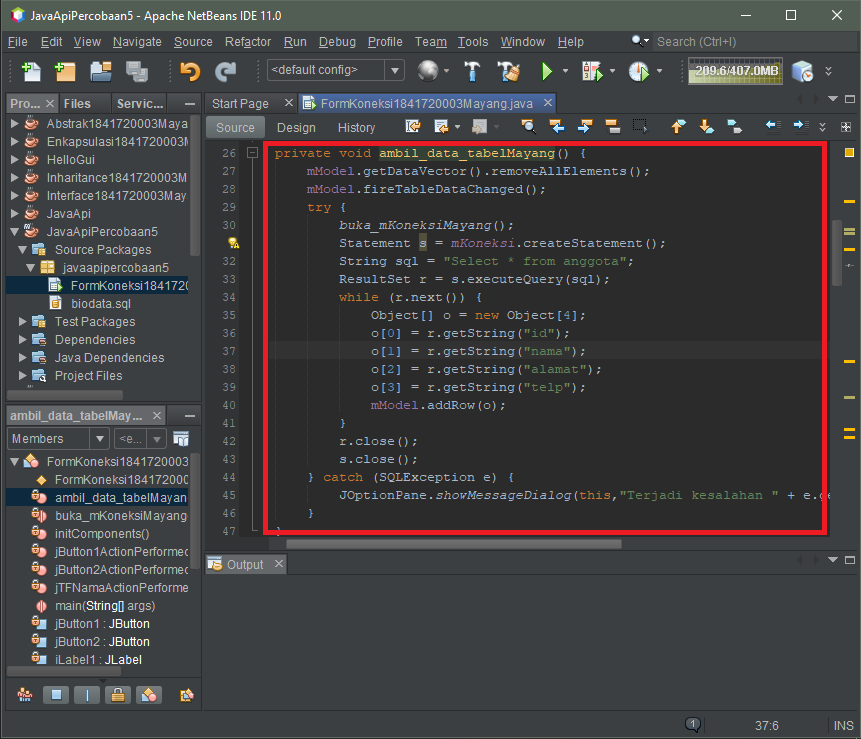
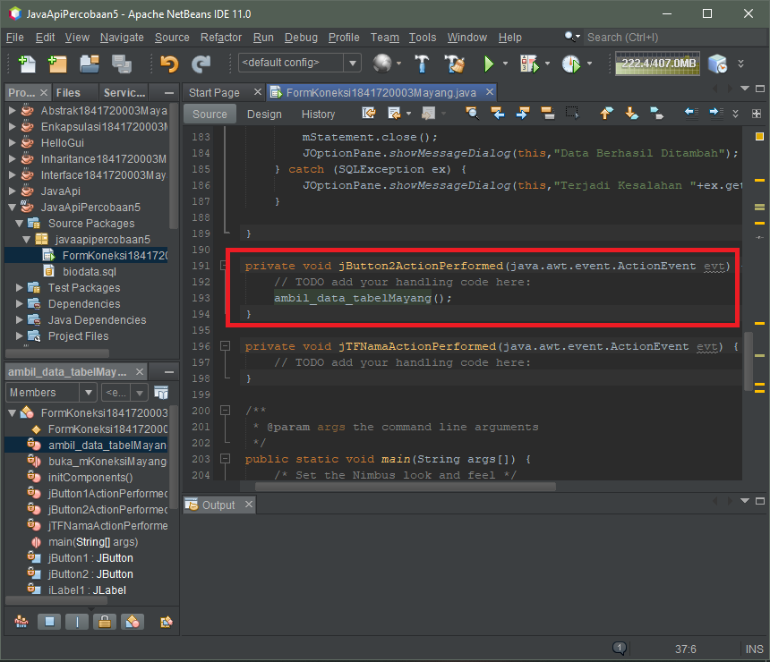

# Laporan Praktikum 12 - JAVA API
# Kompetensi
Setelah menyelesaikan lembar kerja ini mahasiswa diharapkan mampu:
1. Memahami cara penyimpanan objek menggunakan Collection dan Map.
2. Mengetahui pengelompokan dari Collection.
3. Mengetahui perbedaan dari interface Set, List dan Map.
4. Mengetahui penggunaan class-class dari interface Set, List, dan Map.
5. Memahami koneksi database menggunakan JDBC dan JDBC API

## Ringkasan Materi
- HashSet dapat digunakan untuk menyimpan elemen-elemen bebas-duplikat. Pembuatan objek HashSet adalah sebagai berikut:
    
    Set <nama_objek_HashSet> = new HashSet();

- ArrayList digunakan untuk membuat array yang ukurannya dinamis. Pendeklarasian object ArrayList sebaiknya diikuti dengan nama class yang akan dimasukkan dalam List tersebut.Tujuannya agar method dan property dari setiap object dalam ArrayList dapat diakses secara langsung. Pembuatan objek ArrayList adalah sebagai berikut:
    
    ArrayList <nama_objek_arraylist>=new ArrayList();

- HashMap berfungsi sebagai memory record management, dimana setiap record dapat disimpan dalam sebuah Map. kemudian setiap Map diletakkan pada vektor, list atau set yang masih turunan dari collection. Pembuatan objek HashMap adalah sebagai berikut:
    
    HashMap <nama_objek_HashMap> = new HashMap();

## Percobaan
### Percobaan 1 - SET
- Buatlah class main, lalu tambahkan code di method main
    
    

    Class Hash Set--> [DemoHashSet1841720003Mayang.java](../../src/12_Java_API/DemoHashSet1841720003Mayang.java)

### Pertanyaan Percobaan 1
1. Apakah fungsi import java.util.* pada program diatas?

    Jawab:
    Untuk mengimpor semua class yang ada pada java

2. Pada baris program keberapakah yang berfungsi untuk menciptakan object HashSet?

    Jawab:

    

3. Apakah fungsi potongan program dibawah ini pada percobaan 1!

    

    Jawab:
    Untuk mengisi suatu data pada index tersebut

4. Tambahkan set.add(“Malang”); kemudian jalankan program! Amati hasilnya dan jelaskan mengapa terjadi error!

    Jawab:
    Karena pada saat melakukan pengisian data itu membutuhkan objek

5. Jelaskan fungsi potongan program dibawah ini pada percobaan 1!

    

    Jawab:
    Untuk menampilkan nilai dengan lowercase

### Percobaan 2 - LIST
- Buatlah class main, lalu tambahkan code di method main

    

    Class List-> [DemoArrayList1841720003Mayang.java](../../src/12_Java_API/DemoArrayList1841720003Mayang.java)

### Pertanyaan Percobaan 2
1. Apakah fungsi potongan program dibawah ini!

    

    Jawab:
    Menampilkan data dalam bentuk string sesuai index array yang di panggil

2. Ganti potongan program pada soal no 1 menjadi sebagai berikut, Kemudian Jalankan program tersebut

    Jawab:

    

    Class List Modif--> [DemoArrayList1841720003Mayang1.java](../../src/12_Java_API/DemoArrayList1841720003Mayang1.java)

3. Jelaskan perbedaan menampilkan data pada ArrayList menggunakan potongan program pada soal no 1 dan no 2!

    Jawab:
    Soal no 1 menggunakan input data index array, soal no 2 menggunakan iterasi jika ada data maka akan di tampilkan secara urut, jika tidak ada data maka proses iterasi akan berhenti

### Percobaan 3 - MAP
- Buatlah class main, lalu tambahkan code di method main

    

    Class Map--> [DemoMap1841720003Mayang.java](../../src/12_Java_API/DemoMap1841720003Mayang.java)

### Pertanyaan Percobaan 3
1. Jelaskan fungsi hMapItem.put("1","Biskuit") pada program!

    Jawab:
    Digunakan untuk mengisi map dengan pasangan kunci dan nilai. Jika map tersebut telah memiliki kunci maka nilai yang ditunjuk akan diganti dengan yang baru diberikan

2. Jelaskan fungsi hMapItem.size() pada program!
    
    Jawab:
    Untuk mengembalikan int yang berisi jumlah pasangan asosiasi pada map.

3. Jelaskan fungsi hMapItem.remove("1") pada program!

    Jawab:
    Untuk menghapus kunci beserta nilai yang ditunjuknya

4. Jelaskan fungsi hMapItem.clear() pada program!

    Jawab:
    Untuk menghapus semua pasangan asosiasi dalam map

5. Tambahkan kode program yang di blok pada program yang sudah anda buat!

    
    
    Jawab:

    Class Map Modif--> [DemoMap1841720003Mayang1.java](../../src/12_Java_API/DemoMap1841720003Mayang1.java)

6. Jalankan program dan amati apa yang terjadi!

    Jawab:

    

7. Apakah perbedaan program sebelumnya dan setelah ditambahkan kode program pada soal no 5 diatas? Jelaskan!
    Jawab:
    mIterator digunakan untuk menampilkan element pada collection, dimana mCollection tersebut mengambil value dari hMapItem.

### Percobaan 4 - Implementasi ArrayList dalam GUI
- Buatlah class Mahasiswa

    

    Class Mahasiswa--> [Mahasiswa1841720003Mayang.java](../../src/12_Java_API/Mahasiswa1841720003Mayang.java)

- Buatlah class InputData

    

    Class input data--> [InputData1841720003Mayang.java](../../src/12_Java_API/InputData1841720003Mayang.java)

- Buatlah class JFrame dengan nama TampilGui

    Class Tampil gui--> [TampilGui1841720003Mayang.java](../../src/12_Java_API/TampilGui1841720003Mayang.java)

- Maka Hasil nya

    

### Percobaan 5 - Aplikasi Biodata
- Buatlah database dengan MySQL seperti di bawah ini

    

- Buatlah package baru dengan java maven, lalu tambahkan dependencies dengan cara klik kanan kemudian pilih add dependencies
- lalu ketiklah di kolom query "mysql connection java", tunggu beberapa menit, jika sudah cari dengan men-scroll ke bawah "mysql connection java"
- Jika sudah, klik 2 kali lalu pilih file (jar) paling atas, lalu klik add.
-  Pada tahap ini aplikasi sudah siap untuk bertransaksi dengan database yang sudah kita buat, Selanjutnya kita buat method untuk melakukan koneksi dengan database
    
    

    Pada tahap ini, jangan lupa menambahkan (.cj) didepan mysql

- Lalu Pada button add klik tambahkan code sebagai berikut

    

- Setelah menambah code pada action button klik, coba jalankan program dan tambahkan data. Apakah program berhasil menambahkan data? Jika tidak apakah penyebabnya

    Jawab:
    Progam berhasil di tambahkan, namun belum bisa menampilkan data karena belum ada method untuk menampilkan/mengambil data yang sudah di tambahkan

- Jelaskan maksud source code untuk melakukan insert data diatas?

    Jawab:
    Menjalankan method buka_koneksi();, lalu menambahkan tipe data String sql yang berisikan perintah untuk menginsertkan data di text field nama, alamat, telepon ke tabel anggota. try catch merupakan sebuah keterangan apabila berhasil(try) dan jika gagal/trejadi kesalahan(catch)

-  Buat Table model yang digunakan untuk memanipulasi tampilan pada Jtable, seperti pada code dibawah ini:

    

- Selanjutnya buat method ambil_data_tabel seperti berikut

    

Link Menuju ke--> [FormKoneksi1841720003Mayang.java](../../src/12_Java_API/FormKoneksi1841720003Mayang.java)

- Jelaskan alur dari method ambil_data_tabel?

    Jawab:
    menjalankan method model.getDataVector().removeAllElements(); , model.fireTableDataChanged(); lalu mengeksekusi perintah yang ada pada dalam try{}, apabila ada kesalahan / gagal maka yang tereksekusi adalah catch{}

-  Buat fungsi untuk merefresh sehingga data yang baru dapat ditampilkan pada tabel.

    Jawab:

    

***(nb: untuk menjalankan percobaan 5 perlu menyalakan xampp)***

## Kesimpulan
Dari beberapa percobaan diatas, kita bisa tau apa saja yang ada di collection beserta cara penggunaan masing-masing, dan kita juga tau bagaimana cara kerja JDBC,dan cara mengkoneksikan database sql ke java netbeans.

## Pernyataan Diri
Saya menyatakan isi tugas, kode program, dan laporan praktikum ini dibuat oleh saya sendiri. Saya tidak melakukan plagiasi, kecurangan, menyalin/menggandakan milik orang lain. Jika saya melakukan plagiasi, kecurangan, atau melanggar hak kekayaan intelektual, saya siap untuk mendapat sanksi atau hukuman sesuai peraturan perundang-undangan yang berlaku.

Ttd,

***(Mayang Muria Cahyaningsih)***
