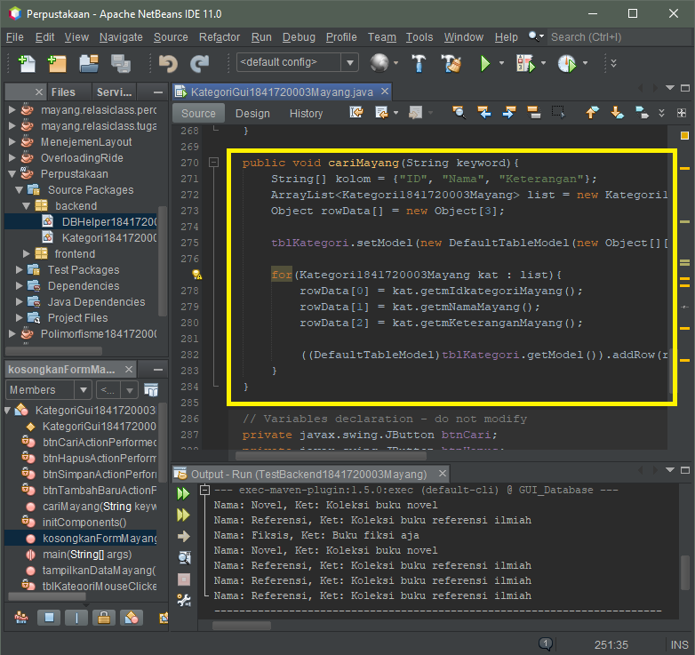

# Laporan Praktikum 14 - GUI dan DATABASE
# Kompetensi
Setelah menempuh materi percobaan ini, mahasiswa mampu mengenal:
1. Menggunakan paradigma berorientasi objek untuk interaksi dengan database
2. Membuat backend dan frontend
3. Membuat form sebagai frontend

## Ringkasan Materi
Library yang digunakan untuk project ini antara lain:
1. JDBC, untuk melakukan interaksi ke database.
2. ArrayList, untuk menampung data hasil query ke database.
3. Swing, untuk membuat tampilan GUI

## Percobaan
### Percobaan 1 - Membuat database.
- Langkah pertama untuk percobaan ini adalah membuat database. Set semua primary key id pada tiap tabel (idanggota, idkategori, idpeminjaman, idbuku) dengan Auto Increment
    
    

### Percobaan 2 - Mempersiapkan project.
- Buat project baru, beri nama Perpustakaan.
- Jika menggunakan java biasa (gradle) cukup menambahkan library lalu pilih MySQL JDBC Driver. karena saya menggunakan java with maven maka Dependencies nya yang perlu di tambahkan.
- lalu buat package frontend dan backend

    

### Percobaan 3 - Membuat class helper untuk mengeksekusi query SQL
- Pada package backend, buat class DBHelper yang berisi method:

    - bukaKoneksi()

        

    -  insertQueryGetId(String query)

        

    - executeQuery(String query)

        

    - selectQuery(String query

        

    Class DBHelper--> [DBHelper1841720003Mayang.java](../../src/14-GUI-Database/DBHelper1841720003Mayang.java)

### Percobaan 4 - Membuat class Kategori untuk menghandle CRUD pada tabel kategori.
- Buatlah class baru yaitu Kategori
- Di dalam class Kategori, tambahkan import java.util.ArrayList dan java.sql.*, Tambahkan atribut sesuai field pada tabel kategori.

    

- Tambahkan setter and getter untuk setiap atribut, dan tambahkan pula konstruktor berparameter dan tidak berparameter

- Tambahkan method getById() untuk mendapatkan objek Kategori yang ada di database berdasarkan id-nya.

    

- Tambahkan method getAll() untuk mendapatkan semua data Kategori yang ada di database, dan ditampung ke ArrayList<Kategori>.

    

- Tambahkan method search() agar bisa melakukan pencarian data. Method ini mirip dengan method getAll() namun querynya berbeda.

    

-  Tambahkan method save(). Method ini memiliki dua fungsi, yaitu insert dan update. Jika data yang diinputkan belum ada (idkategori = 0) maka akan otomatis insert. Jika data yang diinputkan sudah ada, maka otomatis update. dan Tambahkan method delete() untuk melakukan operasi penghapusan pada tabel kategori pada database.

    

Class Kategori --> [Kategori1841720003Mayang.java](../../src/14-GUI-Database/Kategori1841720003Mayang.java)

### Percobaan 5 - Mencoba backed yang sudah dibuat dengan mengoperasikannya lewat frontend berbasis teks (console).
- Buatlah class TestBackend

    

    kenapa output milik saya banyak, karena sebelumnya saya sudah pernah men-run dan mengisi data nya, jadi data nya maish tersimpan di dalam database.

Class TestBackend --> [TestBackend1841720003Mayang.java](../../src/14-GUI-Database/TestBackend1841720003Mayang.java)

### Percobaan 6 - membuat interface GUI untuk class Kategori
- Susun form sehingga seperti berikut ini

    

- Edit kodenya, tambahkan import backend.*, java.util.ArrayList, javax.swing.table.DefaultTableModel;

- Tambahkan method kosongkanForm() untuk mengosongkan isian textbox pada form. lalu Tambahkan method tampilkanData() untuk mengambil semua data kategori dari database dan menampilkannya ke JTable tblKategori.

    

- Tambahkan method cari() untuk melakukan pencarian berdasarkan keyword tertentu.

    

-  Pada konstruktor, tambahkan pemanggilan method kosongkanForm() dan tampilkanData(), agar ketika form ditampilkan pertama kali, maka form isian akan kosong dan data kategori langsung ditampilkan.

    

- Double klik pada btnSimpan untuk menambahkan kode untuk menyimpan data dan Double klik pada btnHapus untuk menambahkan kode untuk menghapus data.

    

- Double klik pada btnTambahBaru untuk mengosongkan form sehingga dapat digunakan untuk menginputkan data baru. lalu Double klik pada btnCari untuk melakukan pencarian terhadap keyword yang dimasukkan pada txtCari. tambahkan action mouse clicked.

    

- Output

    

Class KategoriGui --> [KategoriGui1841720003Mayang.java](../../src/14-GUI-Database/KategoriGui1841720003Mayang.java)

### Percobaan 7 - membuat class anggota beserta testBackend nya
- Buatlah class anggota dengan method yang sama seperti class kategori

    

    Class Anggota --> [AnggotaGui1841720003Mayang.java](../../src/14-GUI-Database/AnggotaGui1841720003Mayang.java)

- Backend dan Hasil dari class Anggota:

    

    Class TestBackend1 --> [TestBackend11841720003Mayang.java](../../src/14-GUI-Database/TestBackend11841720003Mayang.java)

### Percobaan 8 - membuat interface GUI untuk class Anggota
- Buatlah form untuk class Anggota seperti form kategori

    

    Class AnggotaGui --> [AnggotaGui1841720003Mayang.java](../../src/14-GUI-Database/AnggotaGui1841720003Mayang.java)

### Percobaan 9 - membuat class buku beserta backend nya
- Untuk data Buku, caranya kurang lebih sama seperti data Kategori dan Anggota. Hanya saja yang berbeda adalah:
    - Pemanggilan getKategori().getIdKategori() pada query insert dan update untuk mengeset idkategori pada tabel buku
    - Query select yang melibatkan join table pada method getById(), getAll() dan search()

    

    Class Buku --> [Buku1841720003Mayang.java](../../src/14-GUI-Database/Buku1841720003Mayang.java)

- Lalu buat testbackend agar source dapat di run

    

    Class TestBackend Buku --> [TestBackend1841720003Mayang2.java](../../src/14-GUI-Database/TestBackend1841720003Mayang2.java)

### Percobaan 10 - membuat interface GUI untuk class Buku
- Buatlah form untuk class Buku seperti form-form sebelumnya

    

    Class Buku Gui --> [BukuGui1841720003Mayang.java](../../src/14-GUI-Database/BukuGui1841720003Mayang.java)

### TUGAS
- Class Peminjaman

    

    Class Peminjaman --> [Peminjaman1841720003Mayang.java](../../src/14-GUI-Database/Peminjaman1841720003Mayang.java)

- Backend Peminjaman

    

    Class TestBackend3 --> [TestBackend1841720003Mayang3.java](../../src/14-GUI-Database/TestBackend1841720003Mayang3.java)

- GUI class peminjaman

    

    Class Buku Gui --> [PeminjamanGui1841720003Mayang.java](../../src/14-GUI-Database/PeminjamanGui1841720003Mayang.java)

## Kesimpulan
Dari beberapa percobaan diatas, kita bisa mengkoneksikan antara database yang sudah di buat dengan java netbin. dan data yang kita isi otomatis tersimpan dalam database.

## Pernyataan Diri
Saya menyatakan isi tugas, kode program, dan laporan praktikum ini dibuat oleh saya sendiri. Saya tidak melakukan plagiasi, kecurangan, menyalin/menggandakan milik orang lain. Jika saya melakukan plagiasi, kecurangan, atau melanggar hak kekayaan intelektual, saya siap untuk mendapat sanksi atau hukuman sesuai peraturan perundang-undangan yang berlaku.

Ttd,

***(Mayang Muria Cahyaningsih)***
