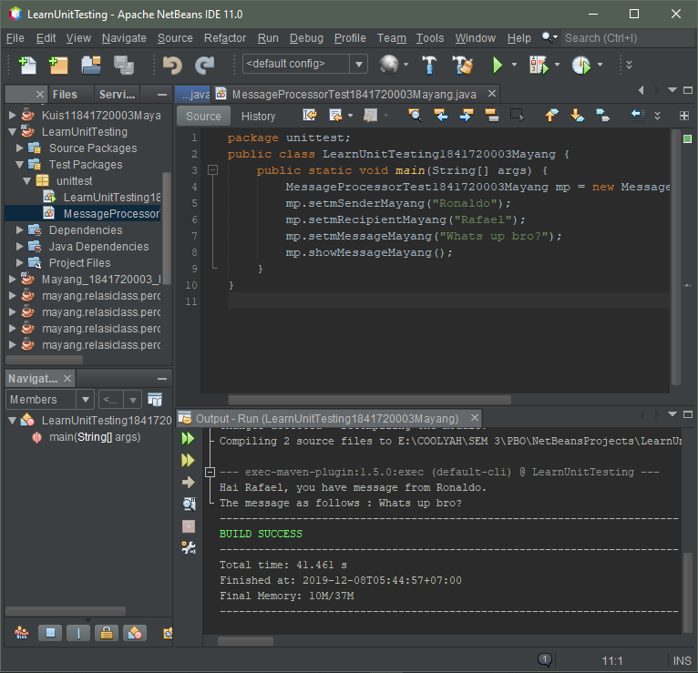
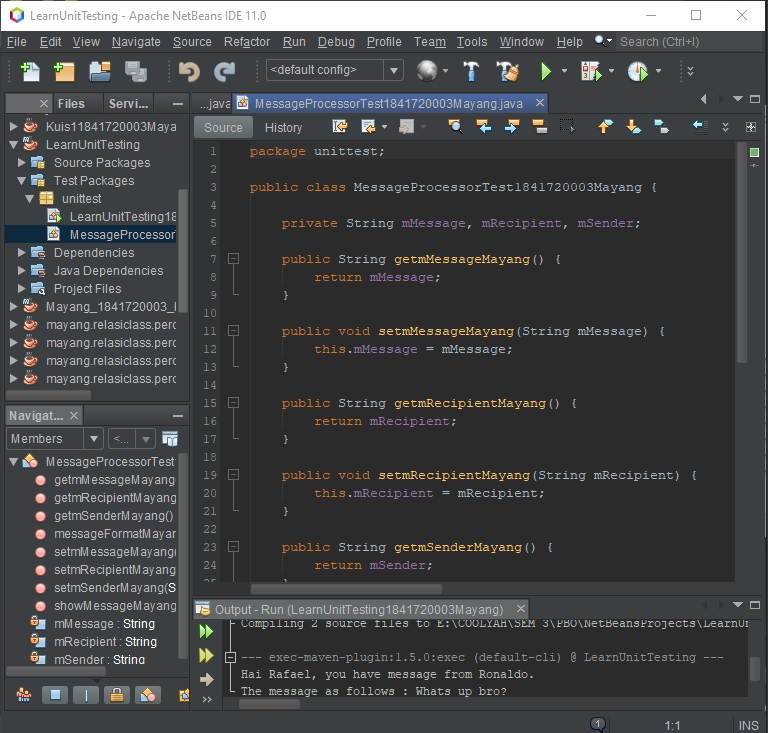
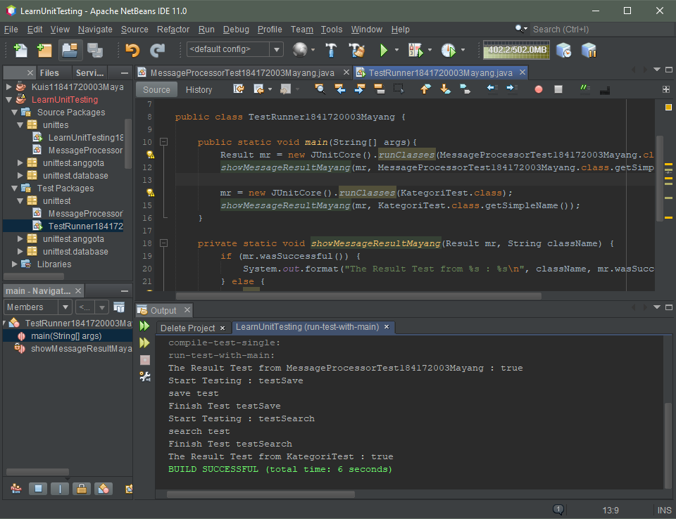
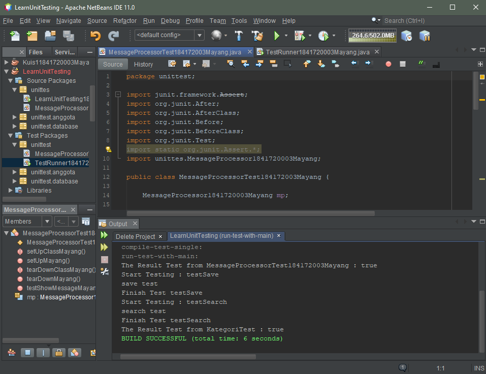
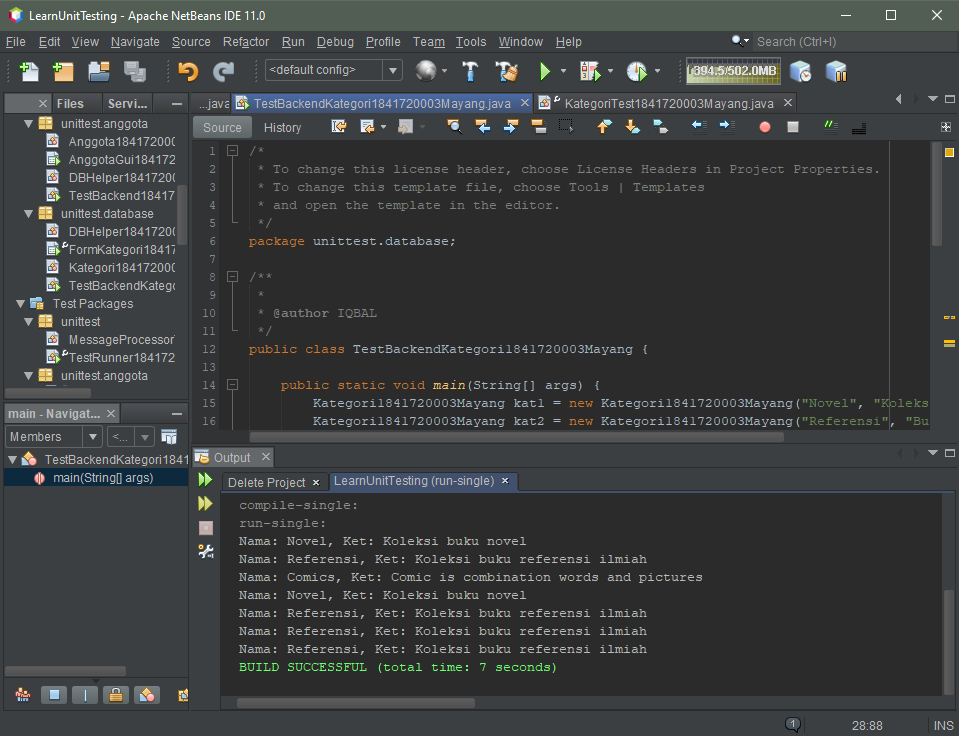
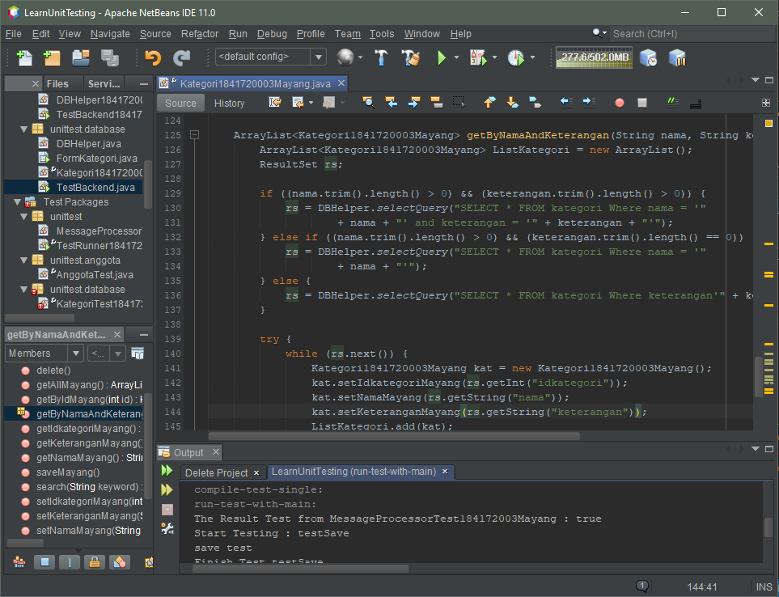
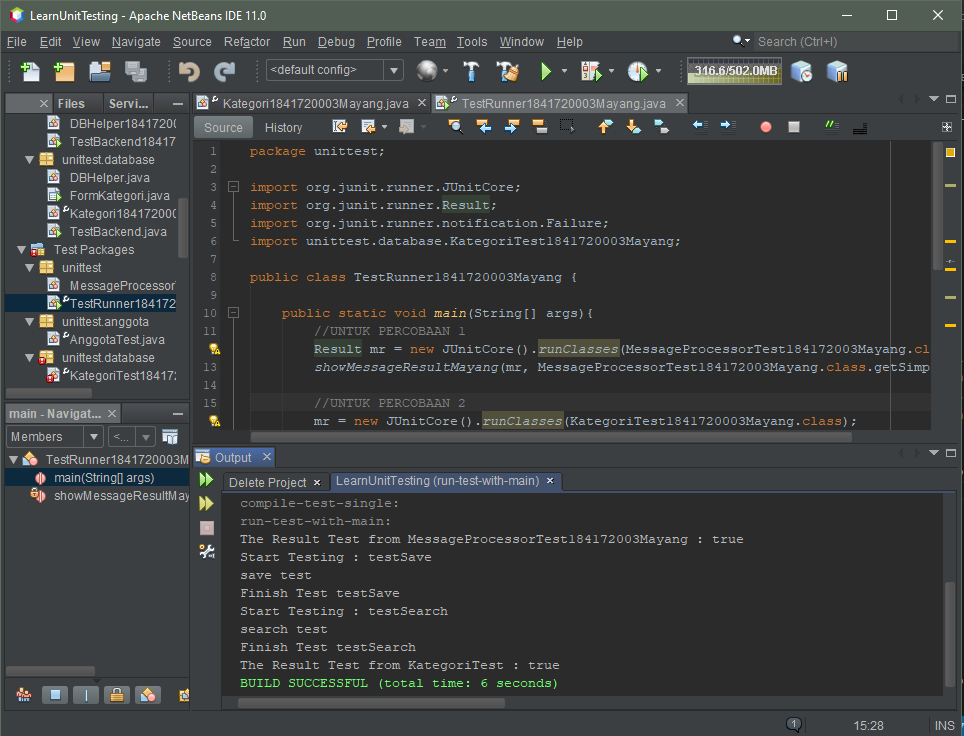

# Laporan Praktikum 15 - UNIT TESTING

## Kompetensi

1. Memahami konsep dan fungsi unit testing 
2. Menerapkan unit testing dengan JUnit pada program sederhana. 
3. Menerapkan unit testing dengan JUnit pada progam yang terkoneksi database 
 
## Ringkasan Materi
Unit testing adalah metode untuk menguji sebuah fungsi untuk mengetahui fungsi tersebut sudah benar atau belum. pada netbeans cara untuk menguji hal tersebut dengan cara membuat class di package test packages dengan menggunakan library JUnit.

## Percobaan
### Percobaan 1 - Dasar Unit Testing
- Membuat Testing
    
    

    Class LearnUnitTesting --> [LearnUnitTesting1841720003Mayang.java](../../src/15_Unit_Testing/LearnUnitTesting1841720003Mayang.java)

    

    Class Message --> [MessageProcessor1841720003Mayang.java](../../src/15_Unit_Testing/MessageProcessor1841720003Mayang.java)

-  Buat pengetesan unit sederhana untuk program kita tersebut. Untuk melakukannya, pertama kali buatlah sebuah package bernama unittesting (sama dengan nama package project), di folder Test Packages. Pada package tersebut,tambahkan 2 buah file class bernama MessageProcessorTest.java dan TestRunner.java. Perhatikan penamaan class testing disini! Untuk menamai class untuk pengetesan maka konvensinya adalah NamaClass + Test = NamaClassTest.

    

    Class LearnUnitTesting --> [TestRunner1841720003Mayang.java](../../src/15_Unit_Testing/TestRunner1841720003Mayang.java)

    

    Class Message --> [MessageProcessorTest184172003Mayang.java](../../src/15_Unit_Testing/MessageProcessorTest184172003Mayang.java)

### Percobaan 2 - Unit Testing dengan Test Case
- Pada percobaan kedua kita akan mencoba membuat test case dari salah satu percobaan pada jobsheet minggu ke 14. Struktur file dari percobaan ke satu terdiri dari 4 file class yaitu DBHelper.java, FormKategori.java, Kategori.java dan TestBackend.java.

    Class --> [DBHelper1841720003Mayang.java](../../src/15_Unit_Testing/DBHelper1841720003Mayang.java)
    
    Class --> [FormKategori1841720003Mayang.java](../../src/15_Unit_Testing/FormKategori1841720003Mayang.java)

    Class --> [Kategori1841720003Mayang.java](../../src/15_Unit_Testing/Kategori1841720003Mayang.java)

    

    Class --> [TestBackendKategori1841720003Mayang.java](../../src/15_Unit_Testing/TestBackendKategori1841720003Mayang.java)

- Test Kategori

    

    Class --> [KategoriTest1841720003Mayang.java](../../src/15_Unit_Testing/KategoriTest1841720003Mayang.java)

# TUGAS

Class --> [Anggota1841720003Mayang.java](../../src/15_Unit_Testing/Anggota1841720003Mayang.java)

Class --> [AnggotaGui1841720003Mayang.java](../../src/15_Unit_Testing/AnggotaGui1841720003Mayang.java)

Class --> [DBHelper1841720003Mayang.java](../../src/15_Unit_Testing/DBHelper1841720003Mayang.java)

Class --> [TestBackend1841720003Mayang1.java](../../src/15_Unit_Testing/TestBackend1841720003Mayang1.java)

Class --> [TestRunner1841720003Mayang.java](../../src/15_Unit_Testing/TestRunner1841720003Mayang.java)

## Kesimpulan
Dari sini kita akan tau fungsi dari unit testing, dan sebelum membuat class nya jangan lupa menggunakan library JUnit

## Pernyataan Diri

Saya menyatakan isi tugas, kode program, dan laporan praktikum ini dibuat oleh saya sendiri. Saya tidak melakukan plagiasi, kecurangan, menyalin/menggandakan milik orang lain.

Jika saya melakukan plagiasi, kecurangan, atau melanggar hak kekayaan intelektual, saya siap untuk mendapat sanksi atau hukuman sesuai peraturan perundang-undangan yang berlaku.

Ttd,

***(Mayang Muria Cahyaningsih)***
***nb: Maaf pak kalau kurang lengkap, saya suntuk***