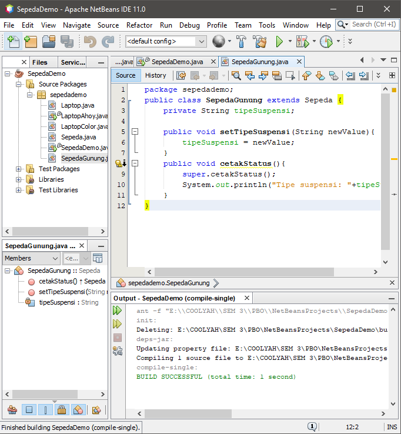

# Laporan Praktikum 1 - Pengantar Konsep PBO
# Kompetensi 
Setelah menempuh materi percobaan ini, mahasiswa mampu mengenal:
1. Perbedaan paradigma berorientasi objek dengan paradigma struktural
2. Konsep dasar PBO

## Ringkasan Materi
1. Di lingkaran merah bawah output menampilkan "warna: null". karena pada dasar nya method warna di objek "spd1" tidak di beri data dan otomatis akan menampilkan output "null" meskipun method warna tidak dipanggil.

2. Extends antara cucu ke kakek. class di cucu dapat di extends ke class bapak. di [SepedaKhusus.java](../../src/1_Pengantar_Konsep_PBO/SepedaKhusus1841720003Mayang.java) class tersebut di extends ke class SepedaGunung,kenapa? ya karena agar dapat mengakses method yang ada di class SepedaGunung. 
fungsi dari modifier "protected" adalah agar objek tersebut hanya bisa di akses oleh class itu sendiri. kode "super" sendiri adalah kode yang di pakai untuk mewakili class induknya.
berikut contohnya:

dan di bawah ini adalah main beserta hasil outputnya:

## Percobaan
### Percobaan 1
Didalam percobaan ini, kita akan mendemonstrasikan bagaimana membuat class, membuat object, kemudian mengakses method didalam class tersebut.

Link menuju script --> [klik disini](../../src/1_Pengantar_Konsep_PBO/Sepeda1841720003Mayang.java)

Lalu kita akan membuat class main yang dimana berisi code untuk memanggil method yang ada di class Sepeda.

Link menuju script --> [klik disini](../../src/1_Pengantar_Konsep_PBO/SepedaDemo1841720003Mayang.java)

### Percobaan 2
Didalam percobaan ini, akan didemonstrasikan salah satu fitur yang paling penting dalam PBO, yaitu inheritance. Disini kita akan membuat class SepedaGunung yang mana adalah turunan/warisan dari class Sepeda. Pada dasarnya class SepedaGunung adalah sama dengan class Sepeda, hanya saja pada sepeda gunung terdapat tipe suspensi. Untuk itu kita tidak perlu membuat class Sepeda Gunung dari nol, tapi kita wariskan saja class Sepeda ke class SepedaGunung.

Link menuju script --> [klik disini](../../src/1_Pengantar_Konsep_PBO/SepedaGunung1841720003Mayang.java)

Lalu kita ubah sedikit dibagian Class main SepedaDemo, kita tambahi code untuk memanggil method dari class SepedaGunung yang dimana merupakan extends dari class Sepeda

Link menuju script --> [klik disini](../../src/1_Pengantar_Konsep_PBO/SepedaDemo1841720003Mayang.java)

## Pertanyaan
1.  Sebutkan dan jelaskan aspek-aspek yang ada pada pemrograman berorientasi objek!

    Jawab:

    - Object adalah suatu rangkaian dalam program yang terdiri dari state dan behaviour.
    - Class adalah kumpulan fungsi-fungsi
    - Enkapsulasi adalah mekanisme pemrograman yang membungkus kode dan data yang di manipulasi. Caranya yaitu dengan membentuk objek.
    - Inheritance disebut juga pewarisan.
    - Polimorfisme juga meniru sifat objek di dunia nyata, dimana sebuah objek dapat memilik bentuk, atau menjelma menjadi bentuk-bentuk lain.

2.	Apa yang dimaksud dengan object dan apa bedanya dengan class?

    Jawab:

    Objek adalah suatu rangkaian dalam program yang terdiri dari state dan behavior yang di modelkan sedemikian rupa sehingga mirip dengan objek yang ada di dunia nyata. Bedanya dengan class adalah class sebagai bungkusnya atau tempatnya. Setiap program harus dibungkus di dalam class agar nanti bisa dibuat menjadi objek.

3.	Sebutkan salah satu kelebihan utama dari pemrograman berorientasi objek dibandingkan dengan pemrograman struktural!

    Jawab:

    Penggunaan kembali kode program lebih tinggi, jadi lebih ringkas.

4.	Pada class Sepeda, terdapat state/atribut apa saja?
    
    Jawab:

    spd1, spd2, spd3

5.	Tambahkan atribut warna pada class Sepeda.
    Jawab:

    penambahan method warna di class sepeda

    

    Link menuju script --> [klik disini](../../src/1_Pengantar_Konsep_PBO/SepedaGunung1841720003Mayang.java)

    yang lalu method warna di panggil ke class SepedaDemo

    

    Link menuju script --> [klik disini](../../src/1_Pengantar_Konsep_PBO/SepedaDemo1841720003Mayang.java)

6.	Mengapa pada saat kita membuat class SepedaGunung, kita tidak perlu membuat class nya dari nol?

    Jawab:

    Karena kita hanya memperluas fungsi dari fungsi yang sebelumnya, dalam artian kita hanya menambahkan fungsi lain karena objek tersebut adalah turunan dari objek yang sebelumnya.

## Tugas
Buatlah program yang merupakan class dari objek yang ada dunia nyata sesuai dengan imajinasi anda. Silahkan merujuk pada kode program praktikum yang sudah kita lakukan sebelumnya untuk sintak-sintak nya

Pertama, kita harus membuat method di class Laptop yang terdiri dari merk, series, windows, microsoft, biaya.

Link menuju script--> [link ke kode program](../../src/1_Pengantar_Konsep_PBO/Laptop1841720003Mayang.java)

ini adalah class turunan dari class Laptop.

Link menuju script --> [klik disini](../../src/1_Pengantar_Konsep_PBO/LaptopColor1841720003Mayang.java)

dan ini adalah class main berserta hasil outputnya.

Link menuju script --> [klik disini](../../src/1_Pengantar_Konsep_PBO/LaptopAhoy1841720003Mayang.java)

## Kesimpulan
Kita ketahui bahwa SepedaGunung pada dasarnya adalah sama dengan Sepeda (memiliki gear, memiliki kecepatan, dapat menambah kecepatan, dapat mengerem, pindah gigi, dsb) namun ada fitur tambahan yaitu tipe suspensi. Maka kita tidak perlu membuat class SepedaGunung dari nol, kita extends atau wariskan saja dari class Sepeda, kemudian kita tinggal tambahkan fitur yang sebelumnya belum ada di class Sepeda. Inilah salah satu kelebihan PBO yang tidak ada di pemrograman struktural.

## Pernyataan Diri
Saya menyatakan isi tugas, kode program, dan laporan praktikum ini dibuat oleh saya sendiri. Saya tidak melakukan plagiasi, kecurangan, menyalin/menggandakan milik orang lain.
Jika saya melakukan plagiasi, kecurangan, atau melanggar hak kekayaan intelektual, saya siap untuk mendapat sanksi atau hukuman sesuai peraturan perundang-undangan yang berlaku.

Ttd,
***(Mayang Muria Cahyaningsih)***
