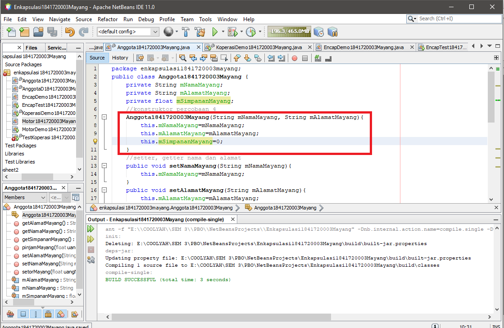

# Laporan Praktikum 3 - ENKAPSULASI
# Kompetensi 
Setelah melakukan percobaan pada modul ini, mahasiswa memahami konsep:
1. Konstruktor
2. Akses Modifier
3. Atribut/method pada class
4. Intansiasi atribut/method
5. Setter dan getter
6. Memahami notasi pada UML Class Diagram

## Ringkasan Materi
- enum (enumeration) adalah tipe data yang memiliki nilai atau literal yang terbatas , contoh:

    Enum color{

        Red=#.....;

        Blue....;

        Green....;   

    }
    
        A=Color.Red;
    
        B=Color.Blue;

- Ada 2 jenis method yaitu:
Void dan Tipe data
- Notasi akses modifier pada UML class diagram adalah sebagai berikut:
1. Tanda plus (+) untuk public
2. Tanda pagar (#) untuk protected
3. Tanda minus (-) untuk private
4. Untuk default, maka tidak diberi notasi
## Percobaan

### Percobaan 1: Enkapsulasi
Didalam percobaan enkapsulasi, buatlah class Motor yang memiliki atribut kecepatan dan kontakOn,
dan memiliki method printStatus() untuk menampilkan status motor

Kemudian buat class MotorDemo, ketikkan kode berikut ini

Dari gambar diatas, 
kecepatan motor berubah dari 0 ke 50. dan posisi kontak motor
masih dalam kondisi OFF.
Nah dalam hal ini, akses ke atribut motor ternyata tidak terkontrol. Padahal, objek di dunia nyata
selalu memiliki batasan dan mekanisme bagaimana objek tersebut dapat digunakan. Kita bisa
pertimbangkan beberapa hal berikut ini:
1. Menyembunyikan atribut internal (kecepatan, kontakOn) dari pengguna (class lain)
2. Menyediakan method khusus untuk mengakses atribut.

### Percobaan 2: Access Modifier
- Ubah access modifier kecepatan dan kontakOn menjadi private
- Tambahkan method nyalakanMesin, matikanMesin, tambahKecepatan,
kurangiKecepatan 
[class Motor.java](../../src/3_Enkapsulasi/Motor1841720003Mayang.java)

- Kemudian pada class main MotorDemo, ubah code menjadi seperti berikut:
[class MotorDemo.java](../../src/3_Enkapsulasi/MotorDemo1841720003Mayang.java)

    Output dari class di atas adalah
    

    Dapat kita amati sekarang atribut kecepatan tidak bisa diakses oleh pengguna dan diganti nilainya secara sembarangan. Bahkan ketika mencoba menambah kecepatan saat posisi kontak masih OFF, maka akan muncul notifikasi bahwa mesin OFF. Untuk mendapatkan kecepatan yang diinginkan, maka harus dilakukan secara gradual, yaitu dengan memanggil method tambahKecepatan() beberapa kali. Hal ini mirip seperti saat kita mengendarai motor.

### Pertanyaan
1. Pada class TestMotor, saat kita menambah kecepatan untuk pertama kalinya, mengapa
muncul peringatan “Kecepatan tidak bisa bertambah karena Mesin Off!”?

    Jawab:
    Karena pada class MotorDemo method nyalakan mesin belum di terpanggil.
2. Mengapa atribut kecepatan dan kontakOn diset private?

    Jawab:
    Agar tidak bisa di akses oleh class lain.
3. Ubah class Motor sehingga kecepatan maksimalnya adalah 100!
    Jawab:
    
    Maka hasilnya seperti di bawah ini
    

### Percobaan 3: Getter dan Setter
Di sebuah sistem informasi koperasi, terdapat class Anggota. Anggota memiliki atribut nama, alamat dan simpanan, dan method setter, getter dan setor dan pinjam.

Jika diperhatikan pada class Anggota, atribut nama dan alamat memiliki masing-masing 1 getter dan setter. Sedangkan atribut simpanan hanya memiliki getSimpanan() saja, karena seperti tujuan awal, atribut simpanan akan berubah nilainya jika melakukan transaksi setor() dan pinjam/tarik()

Selanjutnya buatlah class KoperasiDemo untuk mencoba class Anggota

Maka hasil seperti gambar di atas. Dapat dilihat pada hasil percobaan diatas, untuk mengubah simpanan tidak dilakukan secara langsung dengan mengubah atribut simpanan, melainkan melalui method setor() dan pinjam(). Untuk menampilkan nama pun harus melalui method getNama(), dan untuk menampilkan simpanan melalui getSimpanan().

### Percobaan 4: Konstruktor, Instansiasi
- Langkah pertama percobaan 4 adalah ubah class KoperasiDemo seperti berikut
    
    Dapat dilihat hasil running program, ketika dilakukan pemanggilan method getNama() hasilnya hal ini terjadi karena atribut nama belum diset nilai defaultnya. Hal ini dapat ditangani dengan membuat kontruktor.

- Ubah class Anggota menjadi seperti berikut
    
    Pada class Anggota dibuat kontruktor dengan access modifier default yang memiliki 2 parameter nama dan alamat. Dan didalam konstruktor tersebut dipastikan nilai simpanan untuk pertama kali adalah Rp. 0.

- Selanjutnya ubah class KoperasiDemo dengan mempassing nilai sebagai berikut
    
    Setelah menambah konstruktor pada class Anggoata maka atribut nama dan alamat secara otomatis harus diset terlebih dahulu dengan melakukan passing parameter jika melakukan instansiasi class Anggota. 

### Pertanyaan percobaan 3 dan 4

1. Apa yang dimaksud getter dan setter?

    jawab:
    Getter adalah public method dan memiliki tipe data return, yang berfungsi untuk mendapatkan nilai dari atribut private. Sedangkan setter adalah public method yang tidak memliki tipe data return, yang berfungsi untuk memanipulasi nilai dari atribut private.

2. Apa kegunaan dari method getSimpanan()?

    jawab:
    Untuk menampilkan hasil dari method pinjam dan setor, maka dari itu atribut simpanan di set 0 agar nilai nya dapat berubah-ubah.

3. Method apa yang digunakan untk menambah saldo?

    jawab:
    void setorMayang();

4. Apa yand dimaksud konstruktor?

    jawab:
    Konstruktor mirip dengan method cara deklarasinya akan tetapi tidak memiliki tipe return. Dan konstruktor dieksekusi ketika instan dari objek dibuat.

5. Sebutkan aturan dalam membuat konstruktor?

    jawab:
    - Nama konstruktor harus sama dengan nama class
    - Konstruktor tidak memiliki tipe data return
    - Konstruktor tidak boleh menggunakan modifier abstract, static, final, dan syncronized

6. Apakah boleh konstruktor bertipe private?

    jawab:
    Boleh

7. Kapan menggunakan parameter dengan passsing parameter?

    jawab:
    Pada saat suatu class menggunakan konstruktor

8. Apa perbedaan atribut class dan instansiasi atribut?

    jawab:
    (perbaikan) perbedaannya yaitu kalau atribut class adalah variable yang ada di dalam class sedangkan kalau instansiasi atribut adalah proses pembuatan atribut.

9. Apa perbedaan class method dan instansiasi method?

    jawab:
    (perbaikan) perbedaanya yaitu kalau class method adalah method yang ada di class yang berisi beberapa fungsi, sedangkan instansiasi method adalah proses pembuatan method

## Tugas

1. Cobalah program dibawah ini dan tuliskan hasil outputnya
    
    

2. Pada program diatas, pada class EncapTest kita mengeset age dengan nilai 35, namun pada saat ditampilkan ke layar nilainya 30, jelaskan mengapa?

    Jawab:
    Karena pada class encap terdapat kode
    

    yang artinya jika nilai umur nya lebih dari 30 maka outputnya akan tetap 30, jika nilai umur nya lebih kecil dari 30 maka output nya sesuai nilai yang di isi di variabel umur tersebut.

3. Ubah program diatas agar atribut age dapat diberi nilai maksimal 30 dan minimal 18
    Jawab:
    
    Pada gambar di atas kita akan menambahkan umur maximum dan minimum seperti gambar di atas.
    
    Setelah kita jalankan maka hasil nya akan seperti gambar diatas ini. bisa di simpulkan jika nilai yang ada di variabel age kurang dari 18 dan lebih dari 30 maka output nya akan mengikuti nilai max/min tersebut. begitupun sebaliknya.

4. Pada sebuah sistem informasi koperasi simpan pinjam, terdapat class Anggota yang memiliki atribut antara lain nomor KTP, nama, limit peminjaman, dan jumlah pinjaman. Anggota dapat meminjam uang dengan batas limit peminjaman yang ditentukan. Anggota juga dapat mengangsur pinjaman. Ketika Anggota tersebut mengangsur pinjaman, maka jumlah pinjaman akan berkurang sesuai dengan nominal yang diangsur. Uji dengan TestKoperasi berikut ini untuk memeriksa apakah class Anggota yang anda buat telah sesuai dengan yang diharapkan. 

    Berikut adalah script class main 
    
    Hasil yang diharapkan:
    

    Buatlah class Anggota tersebut, berikan atribut, method dan konstruktor sesuai dengan kebutuhan.

    Jawab:
    Link menuju -->
    [class AnggotaK1841720003Mayang_1.java](../../src/3_Enkapsulasi/AnggotaK1841720003Mayang_1.java)

5. Modifikasi soal no. 4 agar nominal yang dapat diangsur minimal adalah 10% dari jumlah pinjaman saat ini. Jika mengangsur kurang dari itu, maka muncul peringatan “Maaf, angsuran harus 10% dari jumlah pinjaman”.

    Jawab:
    
    Link menuju -->
    [class AnggotaK1841720003Mayang_1.java](../../src/3_Enkapsulasi/AnggotaK1841720003Mayang_1.java)

    Link menuju -->
    [class TestKoperasi1841720003Mayang12.java](../../src/3_Enkapsulasi/TestKoperasi1841720003Mayang12.java)
    

6. Modifikasi class TestKoperasi, agar jumlah pinjaman dan angsuran dapat menerima input dari console.

    Jawab:

    Link menuju -->
    [class AnggotaK1841720003Mayang.java](../../src/3_Enkapsulasi/AnggotaK1841720003Mayang.java)

    Link menuju -->
    [class TestKoperasi1841720003Mayang.java](../../src/3_Enkapsulasi/TestKoperasi1841720003Mayang.java)
    

## Kesimpulan
Dari percobaan diatas, telah dipelajari kosep dari enkapsulasi, kontruktor, access modifier yang terdiri dari 4 jenis yaitu public, protected, default dan private. Konsep atribut atau method class yang ada di dalam blok code class dan konsep instansiasi atribut atau method. Cara penggunaan getter dan setter beserta fungsi dari getter dan setter. Dan juga telah dipelajari atau memahami notasi UML.

## Pernyataan Diri
Saya menyatakan isi tugas, kode program, dan laporan praktikum ini dibuat oleh saya sendiri. Saya tidak melakukan plagiasi, kecurangan, menyalin/menggandakan milik orang lain.
Jika saya melakukan plagiasi, kecurangan, atau melanggar hak kekayaan intelektual, saya siap untuk mendapat sanksi atau hukuman sesuai peraturan perundang-undangan yang berlaku.

Ttd,

***(Mayang Muria Cahyaningsih)***
