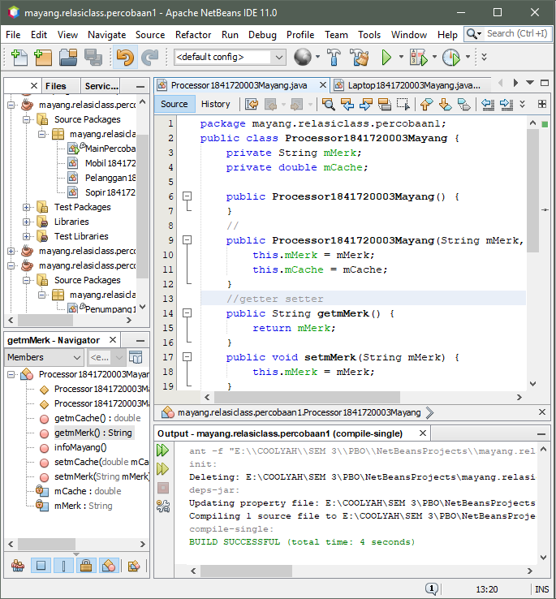
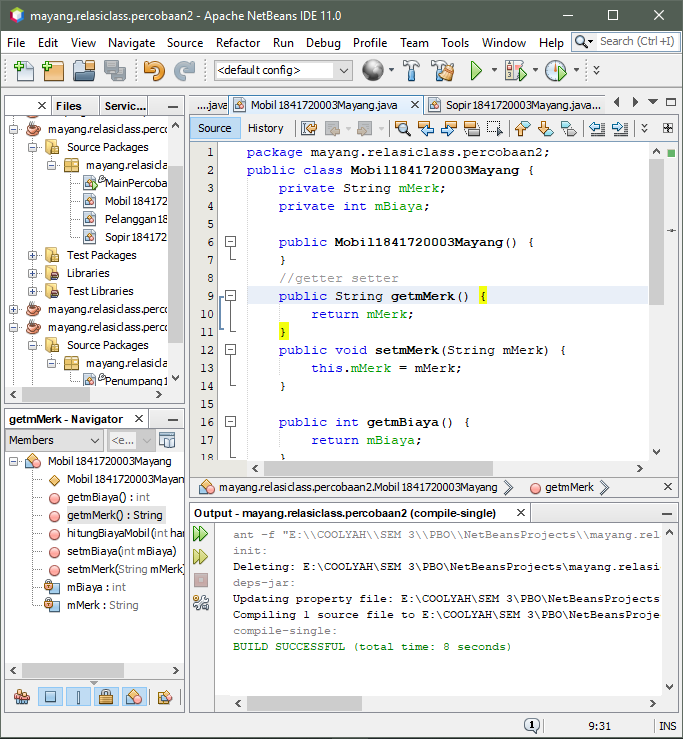
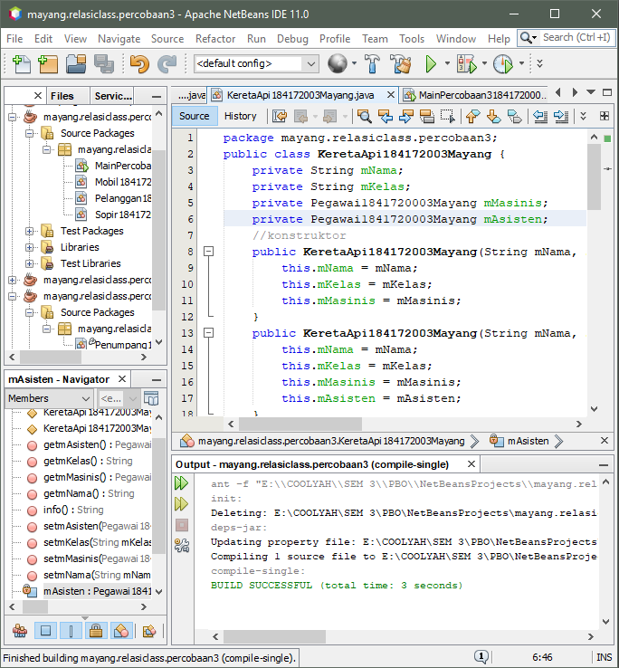
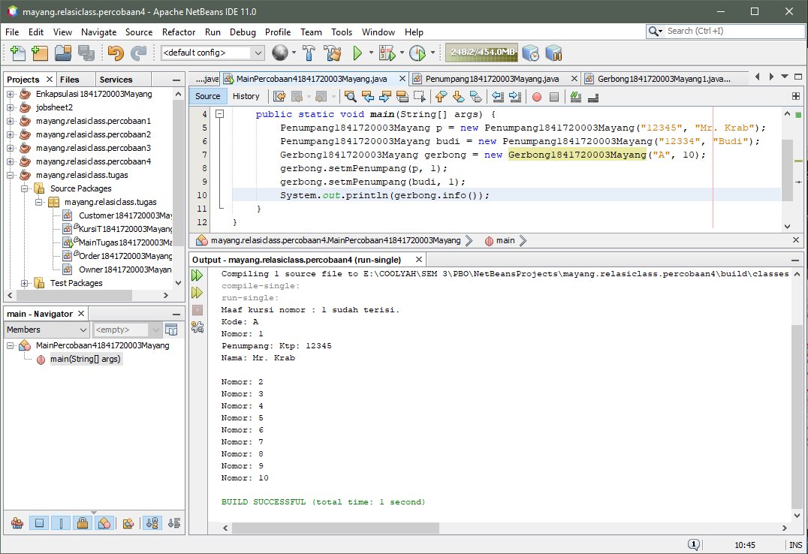

# Laporan Praktikum 4 - RELASI CLASS
# Kompetensi
Setelah menempuh pokok bahasan ini, mahasiswa mampu:
1. Memahami konsep relasi kelas;
2. Mengimplementasikan relasi has‑a dalam program.

## Ringkasan Materi
- Getter dan Setter termasuk enkapsulasi. Getter dan Setter merupakan dua method yang berfungsi untuk mengambil dan mengisi nilai pada suatu objek. Dalam OOP mungkin kita sering mendengar istilah encapsulation, dimana data dibungkus dengan modifier private sehingga tidak bisa diakses dari luar class. Nah karena hal inilah dibutuhkan yang namanya Getter dan Setter.

## Percobaan
### Percobaan 1

- Buatlah class Processor dalam package yang sudah disiapkan.

    public class Processor {
    
    }

- Tambahkan atribut merk dan cache pada class Processor dengan akses modifier private .
    
    private String merk;
    
    private double cache;

- Buatlah constructor default untuk class Processor.

- Buatlah constructor untuk class Processor dengan parameter merk dan cache.

- Implementasikan setter dan getter untuk class Processor.

- Implementasikan method info() seperti berikut:
    
    public void info() {

    System.out.printf("Merk Processor = %s\n", merk);

    System.out.printf("Cache Memory = %.2f\n", cache);

    }
    
    
    
    Link menuju class --> [Processor1841720003Mayang.java](../../src/4_Relasi_Class/Processor1841720003Mayang.java)

- Kemudian buatlah class Laptop di dalam package yang telah di buat.
- Tambahkan atribut merk dengan tipe String dan proc dengan tipe Object Processor
    
    private String merk;

    private Processor proc;

- Buatlah constructor default untuk class Laptop .

- Buatlah constructor untuk class Laptop dengan parameter merk dan proc .

- Selanjutnya implementasikan method info() pada class Laptop sebagai berikut

    public void info() {

    System.out.println("Merk Laptop = " + merk);

    proc.info();

    }
    
    
    
    Link menuju class --> [Laptop1841720003Mayang.java](../../src/4_Relasi_Class/Processor1841720003Mayang.java)

- Pada package yang sama, buatlah class MainPercobaan1 yang berisi method main().

- Deklarasikan Object Processor dengan nama p kemudian instansiasi dengan informasi atribut Intel i5 untuk nilai merk serta 3 untuk nilai cache .

    Processor p = new Processor("Intel i5", 3);

- Kemudian deklarasikan serta instansiasi Objek Laptop dengan nama L dengan informasi atribut Thinkpad dan Objek Processor yang telah dibuat.

- Panggil method info() dari Objek L.

    L.info();

- Tambahkan baris kode berikut

    Processor p1 = new Processor();

    p1.setMerk("Intel i5");

    p1.setCache(4);

    Laptop L1 = new Laptop();

    L1.setMerk("Thinkpad");

    L1.setProc(p1);

    L1.info();

- Compile kemudian run class MainPercobaan1, akan didapatkan hasil seperti berikut:

Link menuju class --> [MainPercobaan11841720003Mayang.java](../../src/4_Relasi_Class/Processor1841720003Mayang.java)

### Pertanyaan percobaan 1
1. Di dalam class Processor dan class Laptop , terdapat method setter dan getter untuk masing‑masing atributnya. Apakah gunanya method setter dan getter tersebut ?
    
    Jawab:
    Fungsinya untuk menge-set (memberi nilai) dan menge-get (mendapatkan/melihat nilai) pada suatu variabel atau class dengan contructor default.

2. Di dalam class Processor dan class Laptop, masing‑masing terdapat konstruktor default dan konstruktor berparameter. Bagaimanakah beda penggunaan dari kedua jenis konstruktor tersebut ?
    
    Jawab:
    Bila konstruktor default, untuk memberi nilai menggunakan setter, tetapi jika kita menggunakan konstruktor berparameter, kita hanya perlu memberi nilai pada saat instansiasi

3. Perhatikan class Laptop, di antara 2 atribut yang dimiliki (merk dan proc), atribut manakah yang bertipe object ?
    
    Jawab:
    proc, karena inisiasi tipe variabel ditandai dengan nama object.

4. Perhatikan class Laptop, pada baris manakah yang menunjukan bahwa class Laptop memiliki relasi dengan class Processor ?
    Jawab:
    
    

5. Perhatikan pada class Laptop , Apakah guna dari sintaks proc.info() ?
    
    Jawab:
    proc.Info(), merupakan syntax yang digunakan untuk menjalankan method Info() pada class Processor.

6. Pada class MainPercobaan1, terdapat baris kode:
    
    Laptop l = new Laptop("Thinkpad", p);.

    Apakah p tersebut ?

    Dan apakah yang terjadi jika baris kode tersebut diubah menjadi:Laptop l = new Laptop("Thinkpad", new Processor("Intel i5",3));

    Bagaimanakah hasil program saat dijalankan, apakah ada perubahan ?
    
    Jawab:
    p merupakan object dari class Processor yang telah diinstansiasi, Lalu kode program yang baru hasilnya sama saja. Kode program tersebut memiliki perbedaan pada instansiasi dalam bentuk variabel object, bila pada kode program l = new Laptop("Thinkpad", new Processor("Intel i5",3)); object tidak perlu diinstansiasi kedalam variabel lain tetapi melakukan instansiasi objek didalam instansiasi object.

### Percobaan 2
Perhatikan diagram class berikut yang menggambarkan sistem rental mobil. Pelanggan bisa menyewa mobil sekaligus sopir. Biaya sopir dan biaya sewa mobil dihitung per hari.

- Tambahkan package <identifier>.relasiclass.percobaan2.

- Buatlah class Mobil di dalam package tersebut.

- Tambahkan atribut merk tipe String dan biaya tipe int dengan akses modifier private.

- Tambahkan constructor default serta setter dan getter.

- Implementasikan method hitungBiayaMobil

    public int hitungBiayaMobil(int hari) {

    return biaya * hari;

    }
    
    
    
    Link menuju class --> [Mobil1841720003Mayang.java](../../src/4_Relasi_Class/Mobil1841720003Mayang.java)

- Tambahkan class Sopir dengan atribut nama tipe String dan biaya tipe int dengan akses modifier private berikut dengan constructor default.

- Implementasikan method hitungBiayaSopir

    public int hitungBiayaSopir(int hari) {

    return biaya * hari;

    }
    
    
    
    Link menuju class --> [Sopir1841720003Mayang.java](../../src/4_Relasi_Class/Sopir1841720003Mayang.java)

- Tambahkan class Pelanggan dengan constructor default.

- Tambahkan atribut‑atribut dengan akses modifier private berikut:

- Implementasikan setter dan getter.

- Tambahkan method hitungBiayaTotal

    public int hitungBiayaTotal() {

    return mobil.hitungBiayaMobil(hari) +

    sopir.hitungBiayaSopir(hari);

    }
    
    
    
    Link menuju class --> [Pelanggan1841720003Mayang.java](../../src/4_Relasi_Class/Pelanggan1841720003Mayang.java)

- Buatlah class MainPercobaan2 yang berisi method main(). Tambahkan baris kode berikut:
    
    

- Compile dan jalankan class MainPercobaan2, dan perhatikan hasilnya!

Link menuju class --> [MainPercobaan21841720003Mayang.java](../../src/4_Relasi_Class/MainPercobaan21841720003Mayang.java)

### Pertanyaan percobaan 2
1. Perhatikan class Pelanggan. Pada baris program manakah yang menunjukan bahwa class Pelanggan memiliki relasi dengan class Mobil dan class Sopir ?

    Jawab:

    

2. Perhatikan method hitungBiayaSopir pada class Sopir, serta method hitungBiayaMobil pada class Mobil. Mengapa menurut Anda method tersebut harus memiliki argument hari ?

    Jawab:
    Argumen tersebut nantinya digunakan untuk diisi suatu nilai bertipe int class Pelanggan.

3. Perhatikan kode dari class Pelanggan. Untuk apakah perintah mobil.hitungBiayaMobil(hari) dan sopir.hitungBiayaSopir(hari) ?

    Jawab:
    Untuk menjumlahkan biaya mobil dan biaya sopir yang sudah di kalikan dengan jumlah hari.

4. Perhatikan class MainPercobaan2. Untuk apakah sintaks p.setMobil(m) dan p.setSopir(s) ?

    Jawab:
    Untuk memberi atau mengisi nilai dari namaMobil dan namaSopir dengan menggunakan nama objek.

5. Perhatikan class MainPercobaan2. Untuk apakah proses p.hitungBiayaTotal() tersebut ?

    Jawab:
    Digunakan untuk menghitung biaya total dari penjumlahan antara biaya sopir dan biaya mobil.

6. Perhatikan class MainPercobaan2, coba tambahkan pada baris terakhir dari method main dan amati perubahan saat di‑run!

    System.out.println(p.getMobil().getMerk()); 

    Jadi untuk apakah sintaks p.getMobil().getMerk() yang ada di dalam method main tersebut?

    Jawab:
    Perintah tersebut digunakan untuk menampilkan nilai atribut dari method  getMobil() dan getMerk() pada class Mobil melalui objek pelanggan.

### Percobaan 3
Sebuah Kereta Api dioperasikan oleh Masinis serta seorang Asisten Masinis. Baik Masinis maupun Asisten Masinis keduanya merupakan Pegawai PT. Kereta Api Indonesia. Dari ilustrasi cerita tersebut, dapat digambarkan dalam diagram kelas sebagai berikut:

- Buatlah package <identifier>.relasiclass.percobaan3, kemudian tambahkan class Pegawai.

- Tambahkan atribut‑atribut ke dalam class Pegawai

    private String nip;

    private String nama;

- Buatlah constructor untuk class Pegawai dengan parameter nip dan nama.

- Tambahkan setter dan getter untuk masing‑masing atribut

- Implementasikan method info() dengan menuliskan baris kode berikut:
    
    public String info() { String info = "";

    info += "Nip: " + this.nip + "\n";

    info += "Nama: " + this.nama + "\n";

    return info;

    }
    
    
    
    Link menuju class --> [Pegawai1841720003Mayang.java](../../src/4_Relasi_Class/Pegawai1841720003Mayang.java)

- Buatlah class KeretaApi berdasarkan diagram class.

- Tambahkan atribut‑atribut pada class KeretaApi berupa nama, kelas, masinis, dan asisten.

    private String nama;

    private String kelas;

    private Pegawai masinis;

    private Pegawai asisten;

- Tambahkan constructor 3 parameter (nama, kelas, masinis) serta 4 parameter (nama, kelas, masinis, asisten).

- Tambahkan setter dan getter untuk atribut‑atribut yang ada pada class KeretaApi.

- Kemudian implementasikan method info()

    public String info() {
    
    String info = "";

    info += "Nama: " + this.nama + "\n";

    info += "Kelas: " + this.kelas + "\n";

    info += "Masinis: " + this.masinis.info() + "\n";

    info += "Asisten: " + this.asisten.info() + "\n";

    return info;

    }
    
    
    
    Link menuju class --> [KeretaApi1841720003Mayang.java](../../src/4_Relasi_Class/KeretaApi1841720003Mayang.java)

- Buatlah sebuah class MainPercobaan3 dalam package yang sama.

- Tambahkan method main() kemudian tuliskan baris kode berikut.

    Pegawai masinis = new Pegawai("1234", "Spongebob Squarepants");

    Pegawai asisten = new Pegawai("4567", "Patrick Star");

    KeretaApi keretaApi = new KeretaApi("Gaya Baru", "Bisnis", masinis, asisten);

    System.out.println(keretaApi.info());

    
    
    Link menuju class --> [MainPercobaan31841720003Mayang.java](../../src/4_Relasi_Class/MainPercobaan31841720003Mayang.java)

### Pertanyaan percobaan 3
1. Di dalam method info() pada class KeretaApi, baris this.masinis.info() dan this.asisten.info() digunakan untuk apa ?

    Jawab:
    Untuk memanggil method Info yang berada di class Pegawai melalui object masinis dan asisten

2. Buatlah main program baru dengan nama class MainPertanyaan pada package yang sama. Tambahkan kode berikut pada method main() !

    
    
    Jawab:
    
    

3. Apa hasil output dari main program tersebut ? Mengapa hal tersebut dapat terjadi ?

    Jawab:
    
    
    
    Karena ada variabel yang tidak bernilai atau null.

4. Perbaiki class KeretaApi sehingga program dapat berjalan !

    Jawab:

### Percobaan 4

- Buatlah masing‑masing class Penumpang, Kursi dan Gerbong sesuai rancangan tersebut pada package <identifier>.relasiclass.percobaan4.

- Tambahkan method info() pada class Penumpang

    public String info() {

    String info = "";

    info += "Ktp: " + ktp + "\n";

    info += "Nama: " + nama + "\n";

    return info;

    }

- Tambahkan method info() pada class Kursi

    public String info() {

    String info = "";

    info += "Nomor: " + nomor + "\n";

    if (this.penumpang != null) {

    info += "Penumpang: " + penumpang.info() + "\n";

    }

    return info;

    }

- Pada class Gerbong buatlah method initKursi() dengan akses private.

    private void initKursi() {

    for (int i = 0; i < arrayKursi.length; i++) {

    this.arrayKursi[i] = new Kursi(String.valueOf(i + 1));

    }
    
    }

- Panggil method initKursi() dalam constructor Gerbong sehingga baris kode menjadi
berikut:

    public Gerbong(String kode, int jumlah) {

    this.kode = kode;

    this.arrayKursi = new Kursi[jumlah];

    this.initKursi();

    }

- Tambahkan method info() pada class Gerbong

    public String info() {

    String info = "";

    info += "Kode: " + kode + "\n";

    for (Kursi kursi : arrayKursi) {

    info += kursi.info();

    }

    return info;

    }
- Implementasikan method untuk memasukkan penumpang sesuai dengan nomor kursi.

    public void setPenumpang(Penumpang penumpang, int nomor) {

    this.arrayKursi[nomor - 1].setPenumpang(penumpang);

    }

    
    
    Link menuju class --> [Penumpang1841720003Mayang.java](../../src/4_Relasi_Class/Penumpang1841720003Mayang.java)

    
    
    Link menuju class --> [KursiT1841720003Mayang.java](../../src/4_Relasi_Class/KursiT1841720003Mayang.java)

    
    
    Link menuju class --> [Gerbong1841720003Mayang1.java](../../src/4_Relasi_Class/Gerbong1841720003Mayang1.java)

- Buatlah class MainPercobaan4 yang berisi method main(). Kemudian tambahkan baris berikut!

    Penumpang p = new Penumpang("12345", "Mr. Krab");

    Gerbong gerbong = new Gerbong("A", 10);

    gerbong.setPenumpang(p, 1);

    System.out.println(gerbong.info());

    
    
    Link menuju class --> [MainPercobaan41841720003Mayang1.java](../../src/4_Relasi_Class/MainPercobaan41841720003Mayang1.java)

### Pertanyaan percobaan 4
1. Pada main program dalam class MainPercobaan4, berapakah jumlah kursi dalam Gerbong A ?

    Jawab:
    10, dapat dilihat pada instansiasi new Gerbong atau pada output bisa dilihat perulangan “Nomer : 10” 

2. Perhatikan potongan kode pada method info() dalam class Kursi. Apa maksud kode tersebut ?
    
    ...

    if (this.penumpang != null) {

    info += "Penumpang: " + penumpang.info() + "\n";

    }

    ...

    Jawab:
    untuk menampilkan kursi yang terisi oleh penumpang, tetapi bila penumpang tidak null, maka kode program yang terdapat pada if tidak dijalankan atau berarti kursi tersebut masih kosong

3. Mengapa pada method setPenumpang() dalam class Gerbong, nilai nomor dikurangi dengan angka 1 ?

    Jawab:
    karena index array selalu dimulai dari 0, oleh karena itu nilai nomer harus dikurangi 1 agar array di index 0 atau di index pertama dapat terisi

4. Instansiasi objek baru budi dengan tipe Penumpang, kemudian masukkan objek baru tersebut pada gerbong dengan gerbong.setPenumpang(budi, 1). Apakah yang terjadi ?

    Jawab:
    
    
    
    Yang terjadi adalah, data yang sebelum nya tertumpuk/terganti oleh data yang baru.

5. Modifikasi program sehingga tidak diperkenankan untuk menduduki kursi yang sudah ada
penumpang lain !

    Jawab:
    
    
    Link menuju class --> [Gerbong1841720003Mayang.java](../../src/4_Relasi_Class/Gerbong1841720003Mayang.java)

    
    
    Link menuju class --> [MainPercobaan41841720003Mayang.java](../../src/4_Relasi_Class/MainPercobaan41841720003Mayang.java)

## Tugas

Link menuju class --> [Customer1841720003Mayang.java](../../src/4_Relasi_Class/Customer1841720003Mayang.java)

Link menuju class --> [Owner1841720003Mayang.java](../../src/4_Relasi_Class/Owner1841720003Mayang.java)

Link menuju class --> [KursiT1841720003Mayang.java](../../src/4_Relasi_Class/Kursit1841720003Mayang.java)

Link menuju class --> [Order1841720003Mayang.java](../../src/4_Relasi_Class/Order1841720003Mayang.java)

Link menuju class --> [MainTugas1841720003Mayang.java](../../src/4_Relasi_Class/MainTugas1841720003Mayang.java)

## Kesimpulan
Dari percobaan diatas, kita telah mempelajarai bagaimana cara kerja relasi class jika di buat program. dan kita bisa mengetahui bagaimana cara bekerja program tersebut.

## Pernyataan Diri
Saya menyatakan isi tugas, kode program, dan laporan praktikum ini dibuat oleh saya sendiri. Saya tidak melakukan plagiasi, kecurangan, menyalin/menggandakan milik orang lain. Jika saya melakukan plagiasi, kecurangan, atau melanggar hak kekayaan intelektual, saya siap untuk mendapat sanksi atau hukuman sesuai peraturan perundang-undangan yang berlaku.

Ttd,

***(Mayang Muria Cahyaningsih)***
