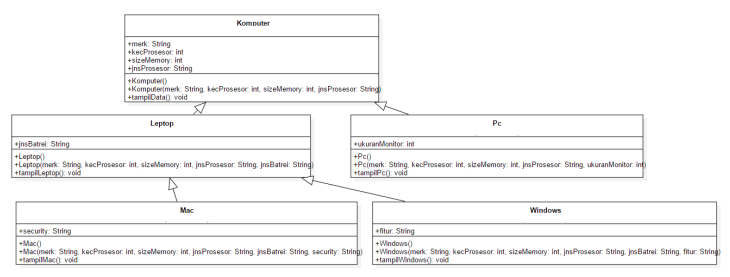

# Laporan Praktikum 6 - INHARITANCE
# Kompetensi
1. Memahami	konsep dasar inheritance atau pewarisan.
2. Mampu membuat suatu subclass	dari suatu superclass tertentu.
3. Mampu mengimplementasikan konsep	single dan multilevel inheritance.
4. Mampu membuat objek dari	suatu subclass dan melakukan pengaksesan terhadap atribut dan method baik yang dimiliki sendiri atau turunan dari superclass nya.

## Ringkasan Materi
- super.namaAtribut

    Merujuk/mengakses atribut dari parent class /superclass
- super.namaMethod()

    Merujuk/memanggil method dari parent class /superclass
- super()

    Merujuk	/ memanggil	konstruktor	parent	class /superclass Hanya	bisa digunakan dibaris pertama dalam kontruktor.
- super(parameter1,	parameter2,dst)

    Merujuk	/ memanggil	konstruktor	berparamter	dari superklas

## Percobaan
### Percobaan 1 (EXTENDS)
- Buatlah class parent/superclass dengan nama ClassA
    

- Buatlah class anak/subclass dengan nama ClassB
    

- Buatlah class Percobaan1 untuk menjalankan program diatas
    

- Kemuadian amati apa yang terjadi!

    jawab:
    Yang terjadi adalah program tersebut mengalami error

### Pertanyaan Percobaan 1
1. Pada	percobaan 1	diatas	program	yang dijalankan	terjadi	error, kemudian perbaiki sehingga program tersebut	bisa dijalankan dan tidak error!

    Jawab:

    

    

2. Jelaskan	apa	penyebab program pada percobaan	1 ketika dijalankan terdapat	error!

    Jawab:
    Agar program ppada percobaan 1 tidak error maka, pada ClassB(anak/subclass) harus di beri kata kunci extends (class parent/superclass)

### Percobaan 2 (Hak Akses)
- Buatlah class parent/superclass dengan nama ClassA
    

- Buatlah class anak/subclass dengan nama ClassB
    

- Buatlah class Percobaan2.java	untuk menjalankan program	diatas!
    

- Jalankan program diatas, kemudian	amati apa yang terjadi!

    Jawab:
    Yang terjadi adalah program tersebut mengalami error

### Pertanyaan Percobaan 2
1. Pada	percobaan 2 diatas program yang	dijalankan terjadi error, kemudian	perbaiki sehingga program tersebut bisa	dijalankan dan tidak error!

    Jawab:
    

2. Jelaskan	apa	penyebab program pada percobaan	2 ketika	dijalankan terdapat	error!

    Jawab:
    Pada class main, hanya ada instansiasi pada class B, sedangkan di main terdapat method dari class A, maka dari itu harus di tambahi instansiasi dari class A agar program dapat berjalan.

### Percobaan 3 (Super)
- Buatlah class parent dengan nama Bangun
    

- Buatlah class anak dengan nama tabung
    

- Buatlah class main Percobaan 3 untuk menjalankan program diatas
    

### Pertanyaan Percobaan 3
1. Jelaskan	fungsi “super” pada	potongan program berikut di class Tabung!

    

    Jawab:
    Untuk mengakses atribut yang ada pada class parent yaitu class Bangun
2. Jelaskan	fungsi “super” dan “this” pada potongan	program berikut	di class Tabung!

    
    
    Jawab:
    Super.phi dan super.r digunakan untuk mengakses atribut dari parent class (Class Bangun). Sedangkan this digunakan untuk mengakses pada class itu sendiri (class Tabung).
3. Jelaskan	mengapa	pada class Tabung tidak	dideklarasikan atribut	“phi” dan “r” tetapi class tersebut	dapat mengakses	atribut	tersebut!

    Jawab:
    Karena menggunkan super untuk memanggil akhses dari class asalnya

### Percobaan 4 (Super	contsructor)
- Buatlah tiga file dengan nama	ClassA.java	, ClassB.java, dan	ClassC.java, seperti pada kode seperti dibawah

    

    

    

- Buatlah class	Percobaan4.java	untuk menjalankan program diatas!
    

### Pertanyaan Percobaan 4
1. Pada	percobaan 4	sebutkan mana class	yang termasuk superclass dan subclass, kemudian jelaskan alasannya!

    Jawab:
    Super class = ClassA (superclass dari ClassB), ClassB (superclass dari ClassC)

    Sub Class = ClassB (subclass dari ClassA), ClassC (subclass dari ClassB)

2. Ubahlah isi konstruktor default ClassC seperti berikut
    
    

    Tambahkan kata super() di baris	Pertaman dalam konstruktor	defaultnya.	Coba jalankan kembali class	Percobaan4 dan terlihat	tidak ada perbedaan	dari hasil	outputnya!

    Jawab:

    

3. Ublah isi konstruktor default ClassC	seperti	berikut:

    

    Ketika	mengubah posisi	super()	dibaris	kedua dalam	kontruktor defaultnya dan terlihat ada error. Kemudian	kembalikan super() kebaris pertama	seperti	sebelumnya,	maka errornya akan hilang. Perhatikan hasil	keluaran	ketika class Percobaan4	dijalankan.	Kenapa	bisa tampil	output seperti berikut pada	saat instansiasi objek test	dari class ClassC

    Jawab:

    

    Super() error karena harus diletakkan di baris pertama pada konstruktor. Hasil akan tetap sama karena pada super()tidak diberi atribut / method. Proses jalannya konstruktor saat objek test dibuat yaitu pertama mengakses ClassC karena class itu yang dipanggil, kemudian dari ClassC program memanggil ClassB sebab ClassC merupakan turunan dari ClassB, lalu terakhir program menjalankan Class A sebab ClassA merupakan parent class dari ClassB.

4. Apakah fungsi super() pada potongan program dibawah	ini	di ClassC!

    

    Jawab:
    Untuk memanggil parent class dari classC , yaitu ClassB sehingga pada ClassC akan menjalankan konstruktor yang ada pada ClassB terlebih dahulu.

### Percobaan 5

- Buatlah Class Karyawan
    
    Link menuju class --> [Karyawan1841720003Mayang.java](../../src/6_Inheritance/Karyawan1841720003Mayang.java)

- Buatlah Class Manager
    
    Link menuju class --> [Manager1841720003Mayang.java](../../src/6_Inheritance/Manager1841720003Mayang.java)

- Buatlah Class Staff
    
    Link menuju class --> [Staff1841720003Mayang.java](../../src/6_Inheritance/Staff1841720003Mayang.java)

- Buatlah Class inharitance 1
    
    Link menuju class --> [Inharitance11841720003Mayang.java](../../src/6_Inheritance/Inharitance11841720003Mayang.java)

### Pertanyaan Percobaan 5
1.  Sebutkan class mana	yang termasuk super	class dan sub	class dari percobaan 1 diatas!

    Jawab:
    Karyawan merupakan superclass dari class Manager dan Staff. Lalu class Manager dan Staff merupakan subclass dari Class Karyawan

2.  Kata kunci apakah yang digunakan untuk menurunkan suatu class ke class yang	lain?

    Jawab:
    Extends

3. Perhatikan kode program pada	class Manager, atribut apa	saja yang dimiliki oleh	class tersebut?	Sebutkan atribut	mana saja yang diwarisi	dari class Karyawan!

    Jawab:
    Atribut asli yang dimiliki adalah tunjangan. sedangkan atribut yang diwarisi adalah gaji

4. Jelaskan	kata kunci super pada potongan program dibawah	ini	yang terdapat pada class Manager!

    

    Jawab:
    super.gaji digunakan untuk mengakses atribut gaji dari class Karyawan lalu gaji tersebut akan ditambah tunjangan yang merupakan atribut class Manager

5. Program	pada percobaan 1 diatas	termasuk dalam jenis inheritance apa? Jelaskan alasannya!

    Jawab:
    termasuk kedalam single inheritance karena sub class hanya memiliki satu parent class

### Percobaan 6

- Buatlah Class Staff Harian
    
    Link menuju class --> [StaffHarian1841720003Mayang.java](../../src/6_Inheritance/StaffHarian1841720003Mayang.java)

- Buatlah Class Staff Tetap
    
    Link menuju class --> [StaffTetap1841720003Mayang.java](../../src/6_Inheritance/StaffTetap1841720003Mayang.java)

- Setelah menbuat 2 class diatas kemudian edit class inharitance1 menjadi seperti dibawah ini:
    
    Link menuju class --> [Inharitance111841720003Mayang.java](../../src/6_Inheritance/Inharitance111841720003Mayang.java)

### Pertanyaan Percobaan 6
1. Berdasarkan class diatas	manakah	yang termasuk single	inheritance	dan	mana yang termasuk multilevel inheritance?

    Jawab:
    single inheritance adalah class Staff merupakan sub class dari class Karyawan. multilevel inheritance adalah class StaffTetap dan StaffHarian merupakan sub class dari class Staff dan class Staf merupakan sub class dari class Karyawan

2. Perhatikan kode program class StaffTetap	dan	StaffHarian atribut	apa	saja yang dimiliki oleh	class tersebut? Sebutkan atribut	mana saja yang diwarisi	dari class Staff!

    Jawab:
    Atribut pada class StaffTetap adalah golongan dan asuransi sedangkan atribut pada class StaffHarian adalah jmlJamKerja. Atribut yang diwarisi dari class staff adalah lembur dan potongan

3. Apakah fungsi potongan program berikut pada class StaffHarian

    

    Jawab:
    Untuk memanggil konstruktor yang punya parameter dari super class (class Staff)

4. Apakah fungsi potongan program berikut pada class	StaffHarian

    

    Jawab:
    untuk memanggil method dari super class(dari class Staff)

5. Terlihat	dipotongan program dibawah ini atribut gaji,lembur dan potongan dapat diakses langsung. Kenapa	hal	ini	bisa terjadi dan bagaimana class StaffTetap memiliki atribut gaji,lembur, dan potongan padahal dalam class tersebut tidak dideklarasikan atribut gaji, lembur, dan potongan?

    

    Jawab:
    karena class StaffTetap merupakan sub class dari class Staff. Sedangkan class Staff merupakan sub class dari class Karyawan sehingga class Staff akan mengakses class Karyawan 

## Tugas

- Class Komputer
    
    Link menuju class --> [Komputer1841720003Mayang.java](../../src/6_Inheritance/Komputer1841720003Mayang.java)

- Class Pc
    
    Link menuju class --> [Pc1841720003Mayang.java](../../src/6_Inheritance/Pc1841720003Mayang.java)

- Class Laptop
    
    Link menuju class --> [Laptop1841720003Mayang.java](../../src/6_Inheritance/Laptop1841720003Mayang.java)

- Class Mac
    
    Link menuju class --> [Mac1841720003Mayang.java](../../src/6_Inheritance/Mac1841720003Mayang.java)

- Class Windows
    
    Link menuju class --> [Windows1841720003Mayang.java](../../src/6_Inheritance/Windows1841720003Mayang.java)

- Class Main Tugas
    
    Link menuju class --> [MainTugas1841720003Mayang.java](../../src/6_Inheritance/MainTugas1841720003Mayang.java)

## Kesimpulan
Dari percobaan diatas, kita telah mempelajarai bagaimana cara kerja extends dan macam-macam super, seperti super contruktor dan lain-lain

## Pernyataan Diri
Saya menyatakan isi tugas, kode program, dan laporan praktikum ini dibuat oleh saya sendiri. Saya tidak melakukan plagiasi, kecurangan, menyalin/menggandakan milik orang lain. Jika saya melakukan plagiasi, kecurangan, atau melanggar hak kekayaan intelektual, saya siap untuk mendapat sanksi atau hukuman sesuai peraturan perundang-undangan yang berlaku.

Ttd,

***(Mayang Muria Cahyaningsih)***
