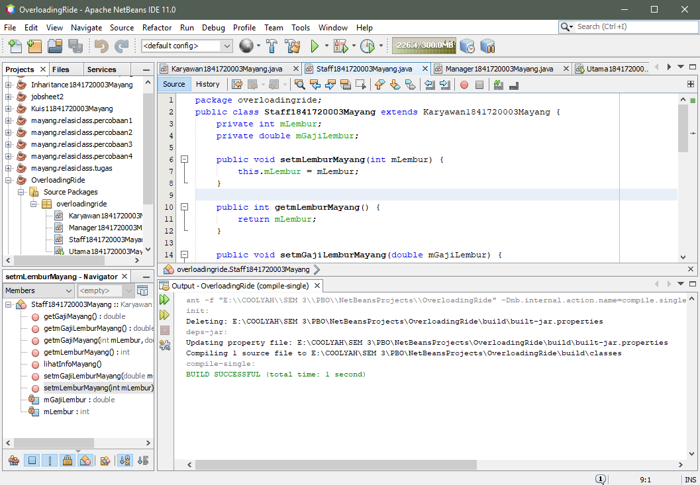

# Laporan Praktikum 7 - OVERLOADING dan OVERRIDING
# Kompetensi
Setelah menempuh pokok bahasan ini, mahasiswa mampu :
1. Memahami konsep overloading dan overriding,
2. Memahami perbedaan overloading dan overriding,
3. Ketepatan dalam mengidentifikasi method overriding dan overloading
4. Ketepatan dalam mempraktekkan instruksi pada jobsheet
5. Mengimplementasikan method overloading dan overriding.

## Ringkasan Materi
Untuk aturan pendeklarasian method Overloading sebagai berikut:
- Nama method harus sama.
- Daftar parameter harus berbeda.
- Return type boleh sama, juga boleh berbeda.

Overidding
Deklarasi method pada subclass harus sama dengan yang terdapat di super class.Kesamaan pada:
- Nama
- Return type (untuk return type : class A atau merupakan subclass dari class A)
- Daftar parameter (jumlah, tipe dan urutan)

Sehingga method pada parent class disebut overridden method dan method pada subclass disebut overriding method. Ada beberapa aturan method didalam overriding:
- Mode akses overriding method harus sama atau lebih luas dari pada overridden method.
- Subclass hanya boleh meng-override method superclass satu kali saja, tidak boleh ada lebih dari satu method pada kelas yang sama persis.
- Overriding method tidak boleh throw checked exceptions yang tidak dideklarasikan oleh overridden method.

## Percobaan
### Percobaan 1
Untuk kasus contoh berikut ini, terdapat tiga kelas, yaitu Karyawan, Manager, dan Staff. Class Karyawan merupakan superclass dari Manager dan Staff dimana subclass Manager dan Staff memiliki method untuk menghitung gaji yang berbeda

- Class Karyawan --> [Karyawan1841720003Mayang.java](../../src/7_Overloading_dan_Overriding/Karyawan1841720003Mayang.java)

    

- Class Staff --> [Staff1841720003Mayang.java](../../src/7_Overloading_dan_Overriding/Staff1841720003Mayang.java)

    

- Class Manager --> [Manager1841720003Mayang.java](../../src/7_Overloading_dan_Overriding/Manager1841720003Mayang.java)

    

- Class Utama --> [Utama1841720003Mayang.java](../../src/7_Overloading_dan_Overriding/Utama1841720003Mayang.java)

    

## Latihan
### Latihan 1

1. Dari source coding diatas terletak dimanakah overloading?
    
    Jawab:

    

2. Jika terdapat overloading ada berapa jumalah parameter yang berbeda?

    Jawab:
    Ada 1, yaitu "int c"

### Latihan 2

1. Dari source coding diatas terletak dimanakah overloading?
    
    Jawab:

    

2. Jika terdapat overloading ada berapa jumalah parameter yang berbeda?

    Jawab: 
    Ada 2, terletak pada tipe data double dengan variable a dan b

### Latihan 3

1. Dari source coding diatas terletak dimanakah overridding?
    
    Jawab:

    

2. Jabarkanlah apabila source coding diatas jika terdapat overridding?

    Jawab: 
    pada class piranha adalah subclass dari class ikan (parent/overriden) maka dari itu class piranha di sebut overridding method.

## Tugas
### Overloading

- Class Segitiga
    
    Link menuju class --> [Segitiga1841720003Mayang.java](../../src/7_Overloading_dan_Overriding/Segitiga1841720003Mayang.java)

- Class main segitiga
    
    Link menuju class --> [Segitiga1841720003Mayang.java](../../src/7_Overloading_dan_Overriding/MainSegitiga1841720003Mayang.java)

### Overridding

- Class manusia
    
    Link menuju class --> [Manusia1841720003Mayang.java](../../src/7_Overloading_dan_Overriding/Manusia1841720003Mayang.java)

- Class dosen
    
    Link menuju class --> [Dosen1841720003Mayang.java](../../src/7_Overloading_dan_Overriding/Dosen1841720003Mayang.java)

- Class mahasiswa
    
    Link menuju class --> [Mahasiswa1841720003Mayang.java](../../src/7_Overloading_dan_Overriding/Mahasiswa1841720003Mayang.java)

- Class main manusia
    
    Link menuju class --> [MainManusia1841720003Mayang.java](../../src/7_Overloading_dan_Overriding/MainManusia1841720003Mayang.java)

## Kesimpulan
Dari percobaan diatas, kita telah mempelajarai bagaimana cara kerja extends overloading dan overriding. dan kita tau bagaimana cara kerja teknik dynamic mehod dispatch, yang dimana dengan kata lain me-replace method parent menjadi method subclass.

## Pernyataan Diri
Saya menyatakan isi tugas, kode program, dan laporan praktikum ini dibuat oleh saya sendiri. Saya tidak melakukan plagiasi, kecurangan, menyalin/menggandakan milik orang lain. Jika saya melakukan plagiasi, kecurangan, atau melanggar hak kekayaan intelektual, saya siap untuk mendapat sanksi atau hukuman sesuai peraturan perundang-undangan yang berlaku.

Ttd,

***(Mayang Muria Cahyaningsih)***