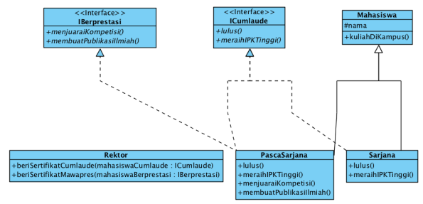
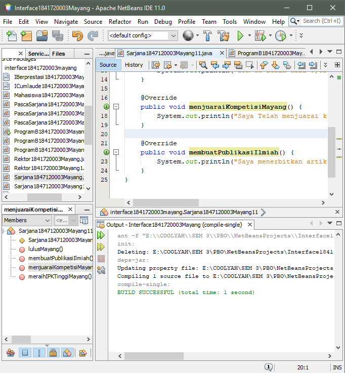

# Laporan Praktikum 9 - ABSTRACT CLASS dan INTERFACE
# Kompetensi
Setelah menyelesaikan lembar kerja ini mahasiswa diharapkan mampu:
1. Menjelaskan maksud dan tujuan penggunaan Abstract Class;
2. Menjelaskan maksud dan tujuan penggunaan Interface;
3. Menerapkan Abstract Class dan Interface di dalam pembuatan program

## Ringkasan Materi
- Kata kunci (abstract) tidak dapat digunakan pada constructor atau method static. Ini juga penting untuk diingat bahwa class abstract tidak dapat di-instantiate
- Ketika suatu abstract class diturunkan/ di-extends, maka subclass harus mengimplementasikan semua method abstract pada parent/ base class. Jika tidak mengimplementasikan semua method abstract maka subclass harus dideklarasikan sebagai abstract class.
- abstrak
    a. Dapat memiliki properties dan methods seperti class biasa.
    b. Selalu memiliki methods yang tidak memiliki tubuh (hanya deklarasinya saja), disebut juga abstract method.
    c. Selalu dideklarasikan dengan menggunakan kata kunci abstract class.
- interface
    a. Tidak ada apa-apa di dalamnya selain abstract methods.
    b. Di konvensi bahasa pemrograman Java, namanya dianjurkan untuk selalu diawali dengan huruf kapital ‘I’.
    c. Selalu dideklarasikan dengan menggunakan kata kunci interface.
    d. Diimplementasikan dengan menggunakan kata kunci implements.

## Percobaan
### Percobaan 1

Pada percobaan pertama ini kita akan membuat sebuah program yang menggambarkan skenario di atas dengan memanfaatkan abstract class.

- Class Hewan --> [Hewan1841720003Mayang.java](../../src/9_Abstract_Class_dan_Interface/Hewan1841720003Mayang.java)

    

    Class Hewan tersebut adalah class abstract berisi property dan method biasa, ditambah sebuah method abstract bernama bergerak(). 

- Buatlah class dengan nama Kucing yang meng-extend class Hewan. 
    Class Kucing --> [Kucing1841720003Mayang.java](../../src/9_Abstract_Class_dan_Interface/Kucing1841720003Mayang.java)

    

- Buatlah class dengan nama ikan yang meng-extend class Hewan. 
    Class Ikan --> [Ikan1841720003Mayang.java](../../src/9_Abstract_Class_dan_Interface/Ikan1841720003Mayang.java)

    

- Buatlah class biasa baru yang bernama class Orang. Class ini adalah class yang menjadi pengguna dari class abstract Hewan yang sudah dibuat sebelumnya.

    Class Orang --> [Orang1841720003Mayang.java](../../src/9_Abstract_Class_dan_Interface/Orang1841720003Mayang.java)

    

- Buatlah sebuah Main Class baru di dalam package yang sama. Beri nama class baru tersebut dengan nama class Program.

    Class Program --> [Program1841720003Mayang.java](../../src/9_Abstract_Class_dan_Interface/Program1841720003Mayang.java)

    

### Pertanyaan Percobaan 1
1. Bolehkah apabila sebuah class yang meng-extend suatu abstract class tidak mengimplementasikan method abstract yang ada di class induknya Buktikan!

    Jawab:
    Tidak boleh, jika tidak di implementasikan maka subclass harus di deklarasikan sebagai abstract

### Percobaan 2
Pada sebuah wisuda, seorang Rektor akan memberikan penghargaan sertifikat Cumlaude pada semua mahasiswa yang memenuhi persyaratan. Persyaratan agar seorang mahasiswa dapat disebut sebagai Cumlaude berbeda-beda antara mahasiswa Sarjana dan Pasca Sarjana.

Untuk menjadi cumlaude, mahasiswa Sarjana harus mengerjakan skripsi dan memiliki IPK lebih tinggi dari 3,51. Sedangkan untuk mahasiswa Pasca Sarjana, mereka harus mengerjakan tesis dan meraih IPK lebih tinggi dari 3,71

- Buatlah class interface ICumlaude, lalu tambahkan 2 abstract methods bernama lulus() dan meraihIPKTinggi().

    Class ICumlaude --> [ICumlaude1841720003Mayang.java](../../src/9_Abstract_Class_dan_Interface/ICumlaude1841720003Mayang.java)

    

- Buatlah sebuah class baru bernama Mahasiswa

    Class Mahasiswa--> [Mahasiswa1841720003Mayang.java](../../src/9_Abstract_Class_dan_Interface/Mahasiswa1841720003Mayang.java)

    

- Buatlah class baru bernama Sarjana yang merupakan turunan dari class Mahasiswa. Class Sarjana tersebut dibuat meng-implements interface ICumlaude yang sudah dibuat sebelumnya tadi. 

    Class Sarjana--> [Sarjana1841720003Mayang.java](../../src/9_Abstract_Class_dan_Interface/Sarjana1841720003Mayang.java)

    

    class Sarjana meng-extend class Mahasiswa, ini berarti, Sarjana adalah Mahasiswa sementara itu agar semua objek dari class Sarjana ini nantinya dapat disebut sebagai Cumlaude maka ia harus meng-implements interface ICumlaude.

- Buatlah class baru bernama PascaSarjana

    Class Pascasarjana--> [Pascasarjana1841720003Mayang.java](../../src/9_Abstract_Class_dan_Interface/Pascasarjana1841720003Mayang.java)

    

- Buatlah class baru bernama Rektor

    Class Rektor--> [Rektor1841720003Mayang.java](../../src/9_Abstract_Class_dan_Interface/Rektor1841720003Mayang.java)

    

- Buatlah sebuah Main Class baru di dalam package yang sama. Beri nama class baru tersebut dengan nama class Program.

    Class Program --> [ProgramB1841720003Mayang.java](../../src/9_Abstract_Class_dan_Interface/ProgramB1841720003Mayang.java)

    

### Pertanyaan Percobaan 2
1. Mengapa pada langkah nomor 9 terjadi error? Jelaskan!

    Jawab:
    Karena pada objek pakRektor memanggil Mahasiswa. Sedangkan class Mahasiswa itu sendiri tidak ter-implements dengan Interface cumlaude.

2. Dapatkah method kuliahDiKampus() dipanggil dari objek sarjanaCumlaude di class Program? Mengapa demikian?

    Jawab:
    Bisa, karena class Sarjana sudah ter-extends dengan class Mahasiswa.

3. Dapatkah method kuliahDiKampus() dipanggil dari parameter mahasiswa di method beriSertifikatCumlaude() pada class Rektor Mengapa demikian?

    Jawab:
    Tidak, sebab pada object pakRektor memanggil method beriSertifikatCumlaude() untuk memanggil inputan sebuah objek yang sudah terinstansiasi. Bukan untuk memanggil method.

4. Modifikasilah method beriSertifikatCumlaude() pada class Rektor agar hasil eksekusi class Program menjadi seperti berikut ini:
    

    Jawab:

    
    Class sarjana modif--> [Sarjana1841720003Mayang1.java](../../src/9_Abstract_Class_dan_Interface/Sarjana1841720003Mayang1.java)

    
    Class pascasarjana modif--> [Pascasarjana1841720003Mayang1.java](../../src/9_Abstract_Class_dan_Interface/Pascasarjana1841720003Mayang1.java)
    
    
    [ProgramB1841720003Mayang1.java](../../src/9_Abstract_Class_dan_Interface/ProgramB1841720003Mayang1.java)

### Percobaan 3
Seorang rektor juga akan memberiSertifikatMawapres() pada sebuah acara wisuda. Mahasiswa yang berhak menerima penghargaan tersebut tentunya adalah mahasiswa yang berprestasi, dimana kriteria prestasi di sini berbeda antara mahasiswa Sarjana dengan mahasiswa Pasca Sarjana. Pada percobaan ini, kita akan menentukan kriteria prestasi yaitu: harus menjuaraiKompetisi() dan membuatPublikasiIlmiah().

- Tambahkan sebuah interface baru yang bernama IBerprestasi.

    Class IBerpretasi--> [IBerpretasi1841720003Mayang.java](../../src/9_Abstract_Class_dan_Interface/IBerpretasi1841720003Mayang.java)

    

- Modifikasilah class PascaSarjana dengan menambahkan interface baru IBerprestasi dibelakang kata kunci implements. lalu tambahkan method abstract dari interface IBerprestasi pada class PascaSarjana.

    Class Pascasarjana--> [PascaSarjana1841720003Mayang11.java](../../src/9_Abstract_Class_dan_Interface/PascaSarjana1841720003Mayang11.java)

    

- Tambahkan method beriSertifikatMawapres() dengan baris kode seperti di bawah, pada class Rektor.

    Class Rektor--> [Rektor1841720003Mayang1.java](../../src/9_Abstract_Class_dan_Interface/Rektor1841720003Mayang1.java)

    

- Modifikasilah method main() pada class Program Anda. lalu tambahkan baris kode baru seperti pada gambar di bawah ini.

    Class Program--> [ProgramB1841720003Mayang11.java](../../src/9_Abstract_Class_dan_Interface/ProgramB1841720003Mayang11.java)

    

### Pertanyaan Percobaan 3
1. Apabila Sarjana Berprestasi harus menjuarai kompetisi NASIONAL dan menerbitkan artikel di jurnal NASIONAL, maka modifikasilah class-class yang terkait pada aplikasi Anda agar di class Program objek pakRektor dapat memberikan sertifikat mawapres pada objek sarjanaCumlaude.

    Jawab:

    Class Sarjana--> [Sarjana1841720003Mayang11.java](../../src/9_Abstract_Class_dan_Interface/Sarjana1841720003Mayang11.java)

    

    Class Program--> [ProgramB1841720003Mayang111.java](../../src/9_Abstract_Class_dan_Interface/ProgramB1841720003Mayang111.java)

    

## Kesimpulan
Jadi intinya method abstrak itu adalah sebuah method yang tidak tahu mau kita apakan nantinya, sebuah class dan method abstrak dibuat sebagai acuan atau gambaran dari program yang ingin mereka buat. 

## Pernyataan Diri
Saya menyatakan isi tugas, kode program, dan laporan praktikum ini dibuat oleh saya sendiri. Saya tidak melakukan plagiasi, kecurangan, menyalin/menggandakan milik orang lain. Jika saya melakukan plagiasi, kecurangan, atau melanggar hak kekayaan intelektual, saya siap untuk mendapat sanksi atau hukuman sesuai peraturan perundang-undangan yang berlaku.

Ttd,

***(Mayang Muria Cahyaningsih)***